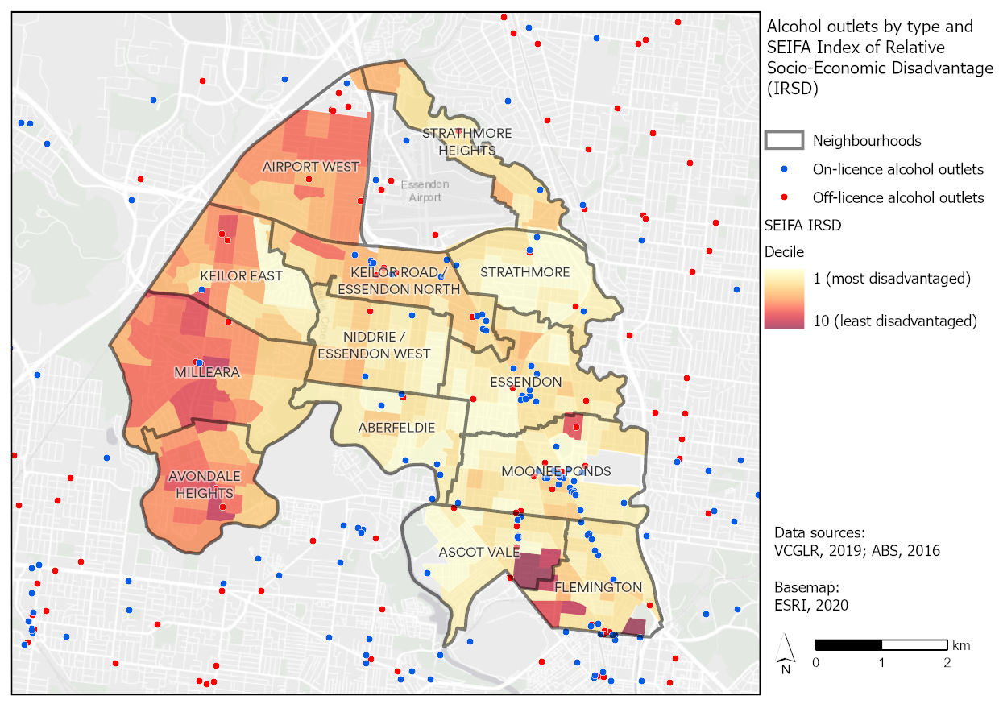
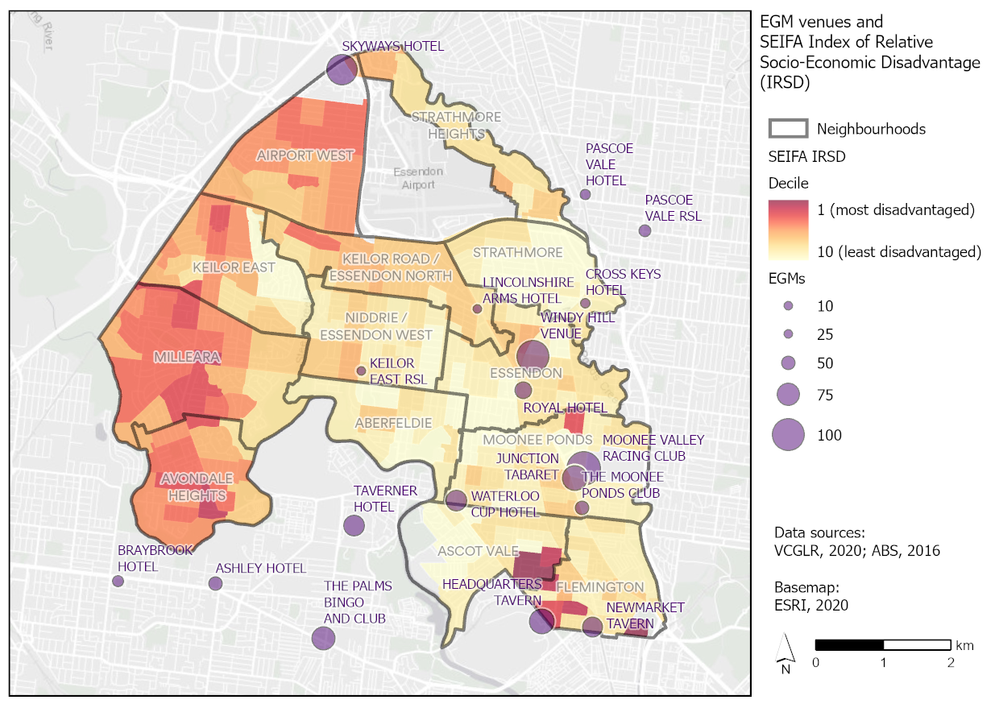

```{r, include = FALSE}
# libraries
pacman::p_load(tidyverse, janitor, readxl, ggpubr, flextable, officer, officedown, scales, glue, sf,
               cartography, captioner, lubridate, ggrepel, cowplot)

#knit options - turns off everything
knitr::opts_chunk$set(echo=FALSE, warning=FALSE, message=FALSE, fig.width = 7)

# colours
fair_red <-  "#E55048"
  
colour_table <- tibble(theme = c("Fair", "Thriving", "Connected", "Green", "Beautiful"),
                       col_code = c("#E55048", "#31788F", "#6A4479", "#4EA546", "#E3A51E"))

mv2040_cols <- c("#E55048", "#31788F", "#6A4479", "#4EA546", "#E3A51E")
mv_corp_cols <- c("#004F71", "#FFCD00", "#41B6E6", "#FF6A13")
mf_cols <- c("#E55048", "#41B6E6", "#E3A51E")
```

# Executive summary

Some sort of infographic like the previous health tracker

\pagebreak

# Introduction

\pagebreak

# Population

## Current and projected

```{r}
pop_hh_raw <- read_excel("data_in/Forecast.id update (December 2017 update).xlsx", sheet = "Population and households") %>% 
  clean_names()

mv_pop_hh <- pop_hh_raw %>% 
  filter(area == "City of Moonee Valley", data_type %in% c("Total Population", "Households"))
```

The population of the City of Moonee Valley is forecast to increase from about 130,000 in 2019, to around 170,000 in 2040.

```{r}
ggplot(mv_pop_hh, aes(year, number, colour = data_type)) +
  geom_point() + geom_line() + 
  theme_pubclean() +
  scale_colour_manual(values = mv2040_cols) +
  theme(legend.position = "bottom") + 
  scale_y_continuous(labels = comma, limits = c(0, 200000)) + 
  labs(title = "Forecast households and population", x = NULL, y = NULL, colour = NULL,
       caption = "Source: .id consulting, 2017")
```

## Age breakdown

```{r}
age_5y_sex_raw <- read_excel("data_in/Forecast.id update (December 2017 update).xlsx", sheet = "Age (by sex - 5yr)") %>% 
  clean_names() %>% 
  rename(age_grp = age_group) %>% 
  mutate(age_grp = str_replace(age_grp, " years and over", " plus")) %>% 
  mutate(age_grp = str_replace(age_grp, " years", "")) %>% 
  mutate(age_grp = factor(age_grp, levels = c("0-4", "5-9", "10-14", "15-19", "20-24", "25-29", "30-34", "35-39", "40-44",
                                              "45-49", "50-54", "55-59", "60-64", "65-69", "70-74", "75-79", "80-84", "85 plus"))) %>% 
  filter(area == "City of Moonee Valley")
```

```{r}
#functions
#data by year
pp_year_data <- function(selected_year){
  age_5y_sex_raw %>% 
  filter(year == selected_year)  %>% 
  group_by(area) %>% 
  mutate(per_cent = number/sum(number)*100) %>% 
  mutate(per_cent = round(per_cent, 2)) %>% 
  mutate(per_cent_label = case_when(gender == "Female" ~ -per_cent,
                              TRUE ~ per_cent))
}

#data by neighbourhood
pp_nh_data <- function(selected_neighbourhood){
  age_5y_sex_raw %>% 
  filter(area == selected_neighbourhood)  %>% 
  filter(year %in% c(2020, 2025, 2030, 2035, 2040)) %>% 
  group_by(area, year) %>% 
  mutate(per_cent = number/sum(number)*100) %>% 
  mutate(per_cent = round(per_cent, 2)) %>% 
  mutate(per_cent_label = case_when(gender == "Female" ~ -per_cent,
                              TRUE ~ per_cent))
}

```

The population structure of the City of Moonee Valley is not forecast to change greatly between 2020 and 2040. There will be an increase in all age groups, though there will be a slight increase in the median age and a greater proportion of older residents.

```{r, fig.height=4.25, fig.width=7}
pp_mv <- pp_nh_data("City of Moonee Valley") %>% 
  filter(year %in% c(2020, 2040))

ggplot(pp_mv, aes(age_grp, per_cent_label, fill = gender)) +
  geom_bar(stat = "identity", width = 1) + 
  theme_pubclean() + 
  scale_y_continuous(breaks=c(-4, -2, 0, 2, 4), labels=c("4%", "2%", "0%", "2%", "4%")) + 
  coord_flip() + 
  scale_fill_manual(values = mv2040_cols) + 
  labs(x = NULL, y = NULL, fill = NULL, title = "City of Moonee Valley forecast population structure", subtitle = "By year (at 30 June)", caption = "Data source: .id consulting, 2017") + 
  facet_wrap(~factor(year), ncol = 8) + theme(legend.position = "bottom") 

```

* Location of over 65s
* 0-25?

## Self-reported health

Data from the Victorian Population Health Survey 2017 shows that about 47.5 per cent of Moonee Valley residents reported either 'excellent' or 'very good' health. Thic compares to about 42 per cent for Victoria and the Western Melbourne Area.

```{r, fig.height=2.5, fig.width=7}
# function more just for single plots
vphs_ggplot_function <- function(dataset, title_text, yval = 2.5,  subtitle_text = NULL,
                                 caption_text = "Source: Victorian Population Health Survey, 2017"){
  ggplot(dataset, aes(fct_rev(region), pct, fill = region)) + 
  theme_pubclean() + 
  geom_col() + geom_errorbar(aes(ymin = ll, ymax = ul, width=.1)) + coord_flip() +
  geom_text(aes(label = pct, y = yval), col = "white", fontface = "bold") +
  scale_fill_manual(values = mv2040_cols) + theme(legend.position = "none") + 
  labs(title = title_text, subtitle = subtitle_text,
       x = NULL, y = "Percentage (with 95% CI)",
       caption = caption_text)
}

vphs_srhealth <- read_csv("data_in/vphs/vphs_srhealth.csv") %>%  # anxiety or depression
  filter(selections == "Excellent / very good")

vphs_ggplot_function(dataset = vphs_srhealth, yval = 2, title_text = "Self-reported health",
                     subtitle_text = "Excellent or very good health status")
```

The same data shows that women in Moonee Valley were more likely to self-report higher levels of health than males.

```{r, fig.height=2.5, fig.width=7}
vphs_srh_gender <- tibble(
            gender = c("Women", "Women", "Women", "Men", "Men", "Men"),
         selection = c("Excellent/Very good","Good",
                       "Fair/Poor","Excellent/Very good","Good","Fair/Poor"),
               pct = c(53.7, 27.9, 18.2, 41.1, 42.3, 16.6),
                ll = c(46, 21.8, 13.2, 32.7, 33.9, 11),
                ul = c(61.3, 35, 24.6, 50, 51.2, 24.3)) %>% 
  mutate(selection = factor(selection, levels = c("Excellent/Very good","Good", "Fair/Poor")))

ggplot(vphs_srh_gender, aes(fct_rev(selection), pct, fill = selection)) + 
  theme_pubclean() +
  geom_col() + geom_errorbar(aes(ymin = ll, ymax = ul, width=.1)) + facet_wrap(~gender, ncol = 3) +
  geom_text(aes(label = pct, y = 5), col = "white", fontface = "bold") +
  scale_fill_manual(values = mv2040_cols) + theme(legend.position = "none") + coord_flip() +
  labs(title = "Self-reported health status by gender", 
       x = NULL, y = "Percentage (with 95% CI)", caption = "Source: Victorian Population Health Survey, 2017")
```


# Environmental factors

## Socio-economic disadvantage

```{r}
irsd_raw <- read_csv("data_in/SEIFA2016IRSD.csv") %>%
  clean_names() %>%
  rename(sa1 = sa1_7digit_code_2016, nh = neighbourhood, pop = usual_resident_population) %>%
  mutate(nh = str_to_title(nh)) %>%
  mutate(nh = str_replace_all(nh, "/", "-\n")) %>%
  mutate(sa1 = as.character(sa1))

irsd_nh <- irsd_raw %>%
  select(-sa1, -score) %>%
  group_by(nh, decile) %>%
  summarise(pop = sum(pop)) %>%
  ungroup %>%
  group_by(nh) %>%
  mutate(prop = pop/sum(pop))
# 
# sa1_shp <- st_read("data_in/shp/SA1_2016_MV.shp", quiet = TRUE) %>% 
#   clean_names() %>% 
#   select(sa1 = sa1_7digit)
# 
# seifa_shp <- sa1_shp %>% 
#   left_join(irsd_raw, by = "sa1") %>% 
#   select(sa1, decile) %>% 
#   filter(!is.na(decile))
```

Data from the Socio-Economic Indexes for Areas (SEIFA) Index of Relative Socio-economic Disadvantage (IRSD) shows that there is great economic diversity in Moonee Valley households. There are pockets of disadvantage in neighbourhoods like Flemington, Ascot Vale, Avondale Heights and Milleara. In contrast, Strathmore and Strathmore Heights are the least disadvantaged neighbourhoods.

```{r, fig.height= 6, fig.width=7}
ggplot(irsd_nh, aes(decile, prop)) +
  geom_col(fill = "#E55048") + facet_wrap(~nh, nrow =4) + theme(legend.position="none") +
  theme_pubclean() +
  labs(title = "SEIFA Index of Relative Socio-economic Disadvantage (IRSD)",
       subtitle = "By neighbourhood", caption = "Data source: ABS, 2016 Census",
       x = "SEIFA IRSD decile (1 = most disadvantaged, 10 = least disadvantaged)", y = "Percentage of neighbourhood population") + 
  scale_x_continuous(breaks=c(seq(1,10,1))) + scale_y_continuous(labels = percent)
```

This disparity is shown on the map below. The greatest concentrations of disadvantage are one the public housing estates in Flemington and Ascot Vale.


```{r}
# plot(st_geometry(seifa_shp), col = NA, border = NA, bg = "white")
# # plot population density
# choroLayer(
#   x = seifa_shp, 
#   var = "decile",
#   method = "pretty",
#   nclass=5,
#   col = rev(carto.pal(pal1 = "orange.pal", n1 = 5)),
#   border = "white", 
#   lwd = 0.5,
#   legend.pos = "topright", 
#   legend.title.txt = "SEIFA IRSD decile",
#   add = TRUE
# ) 
# # layout
# layoutLayer(title = "IRSD decile by SA1", 
#             sources = "Source: ABS, 2016",
#             frame = FALSE, north = FALSE, tabtitle = TRUE, col = "white", coltitle = "black") 
# # north arrow
# north(pos = "topleft")
```


## Heat Vulnerability Index

The Heat Vulnerability Index measures the impact of the Urban Heat Island effect on vulnerable populations. Within Moonee Valley, the most vulnerable areas are in the east of the municipality, where there is a higher concentration of older adults.

```{r}
# hvi_shp <- st_read("data_in/shp/HEAT_VULNERABILITY_INDEX_2018.shp", quiet = TRUE) %>% 
#   clean_names() %>% 
#   filter(sa3_name16 %in% c("Essendon", "Keilor")) %>% 
#   filter(!sa2_name16 %in% "Keilor") %>% 
#   select(sa1 = sa1_7dig16, hvi_index, pop_dens = popu_dens)
```


```{r}
# plot(st_geometry(hvi_shp), col = NA, border = NA, bg = "white")
# # plot population density
# choroLayer(
#   x = hvi_shp, 
#   var = "hvi_index",
#   method = "equal",
#   nclass=5,
#   col = carto.pal(pal1 = "orange.pal", n1 = 5),
#   border = "white", 
#   lwd = 0.5,
#   legend.pos = "topright", 
#   legend.title.txt = "Heat Vulnerability",
#   add = TRUE
# ) 
# # layout
# layoutLayer(title = "Heat Vulnerability Index by SA1", 
#             sources = "Source: DELWP, 2019",
#             frame = FALSE, north = FALSE, tabtitle = TRUE, col = "white", coltitle = "black") 
# # north arrow
# north(pos = "topleft")
```

## Walkability

* See what Evie has done

# Gender inequality

* some differences between genders from the Census and VPHS
* also from this https://victorianwomenshealthatlas.net.au/reports%2Ffactsheets%2FGender%20Equality%2FMoonee%20Valley%2FVWHAtlas%20Fact%20Sheet%20Gender%20Equality%20Moonee%20Valley.pdf

plus

* education
* labour force status
* occupation type

# Employment

* types of jobs?

## Unemployment rate

The unemployment rate in the City of Moonee Valley has generally been lower than the rate for Greater Melbourne.

```{r, fig.height=3, fig.width=7}
# import from economic tracker
salm_raw <- read_csv("data_in/salm_chart_rate_data.csv") 

salm_mv <- salm_raw %>% 
  filter(region %in% c("City of Moonee Valley", "Greater Melbourne")) 

ggplot(salm_mv, aes(date, values, colour = region, label = values)) +
  geom_point() + geom_line() + ylim(3.5, 7.5) +
  theme_pubclean() +
  theme(legend.position = "bottom") + 
  scale_colour_manual(values = mv2040_cols) + 
  geom_text_repel(data = salm_mv %>% filter(date == as.Date("2020-03-01")), show.legend = FALSE) +
  labs(title = "Unemployment Rate", x = NULL, y = "Unemployment rate (%)", colour = NULL,
       caption = "Source: Small Area Labour Markets, Department of Education, Skills and Employment, 2020")
```

The unemployment rate is highest in the Flemington and Ascot Vale Statistical Area Level 2 (SA2) geographical areas.

```{r}
salm_sa2 <- salm_raw %>% 
  filter(region != "City of Moonee Valley") %>% 
  filter(region != "Greater Melbourne")

ggplot(salm_sa2, aes(date, values, colour = fair_red, label = values)) +
  geom_point() + geom_line() + facet_wrap(~region) +
  theme_pubclean() +
  theme(legend.position = "none") + 
  labs(title = "Unemployment Rate (Statistical Area Level 2)", x = NULL, y = "Unemployment rate (%)", colour = NULL,
       caption = "Source: Small Area Labour Markets, Department of Education, Skills and Employment, 2020")
```

# Affordable housing

According to the Rental Report from the Department of Health and Human Services, there were 21 affordable lettings in Moonee Valley in June 2020. These are private rental properties (newly leased) affordable to households on statutory incomes by bedroom number. There have been fewer than 30 affordable lettings in Moonee Valley since 2015. 

```{r, fig.height=4, fig.width=7}
rr_affordable_lga <- read_csv("data_in/dhhs_rental_report/lga_affordable.csv")

mv_affordable <- rr_affordable_lga %>% 
  filter(region == "Moonee Valley", type == "Affordable lettings") %>% 
  mutate(values = as.integer(values)) %>% 
  filter(bedrooms != "total") %>% 
  filter(month >= as.Date("2005-01-01"))

# # just a look at the totals
# rr_affordable_lga %>%
#   filter(region == "Moonee Valley", type == "Affordable lettings") %>%
#   mutate(values = as.integer(values)) %>%
#   filter(bedrooms == "total") %>%
#   tail(30)

ggplot(mv_affordable, aes(month, values, colour = bedrooms, label = values)) +
  geom_point() + geom_line() + 
  theme_pubclean() +
  scale_color_manual(values = mv2040_cols) +
  theme(legend.position = c(0.9, 0.8)) + 
  labs(title = "Affordable lettings, City of Moonee Valley",
       x = NULL, y = "Dwellings", colour = "Bedrooms",
       caption = "Source: Rental Report, Department of Health and Human Services, 2020")
```

* add the prices as well by suburb and the amounts perhaps

# Community Safety

Data from the Community Survey shows that about less than half of all residents feel safe walking alone in their local area at night. About 80 per cent feel safe at public transport stops and stations, while almost all residents feel safe when walking alone in their local area during the day.

```{r, fig.width=7, fig.height=4}
cs_safety <- read_csv("data_in/community_survey/safety_full_2020.csv")

cs_safety_mv <- cs_safety %>% 
  filter(cat == "Overall") %>% 
  filter(safety == "'Very safe' or 'safe'") %>% 
  mutate(name = str_replace(name, "your local", "your \nlocal")) %>% 
  mutate(name = str_replace(name, "stops and", "stops \nand"))

ggplot(cs_safety_mv, aes(year, pct, label = pct, colour = name)) +
  theme_pubclean() +
  geom_point() + geom_line()  + ylim(0, 100) + 
  geom_errorbar(aes(ymin = lower, ymax = upper, width=.05), colour = "darkgrey") +
  labs(title="Community safety",
       x = NULL, y = "Percentage (with 95% CI)", colour = NULL,
       caption = "Source: Moonee Valley Community Survey, 2020") +
  scale_color_manual(values = mv2040_cols) + scale_x_continuous(breaks = seq(2018, 2020, 1)) +
  theme(legend.position = "bottom") +
  geom_text_repel(show.legend = FALSE)
```


# Health Status

## Oral health

Data from the Victorian Population Health Survey shows that Moonee Valley residents have better self-reported dental health, lower incidence of gum disease when compared to the Western Melbourne Area and Victoria. Moonee Valley residents are also less likely to delay visiting a dental professional because of cost when compared to Victoria.

```{r, fig.height=3, fig.width=7}
vphs_srdhs <- read_csv("data_in/vphs/vphs_srdhs.csv") %>%  # self reported dental health status
  filter(selections == "Excellent / Very good") %>% 
  mutate(type = "Self-reported dental\nhealth status \n (Excellent or very good)")
vphs_srgd <- read_csv("data_in/vphs/vphs_srgd.csv") %>% # self reported gum disease
  filter(selections == "Yes") %>% 
  mutate(type = "Self-reported gum disease")
vphs_addbc <- read_csv("data_in/vphs/vphs_addbc.csv") %>% # avoided or delayed dental because of cost
  filter(selections == "Yes") %>% 
  mutate(type = "Delayed visiting \ndental professional \nbecause of cost")

vphs_dental <- bind_rows(vphs_srdhs, vphs_srgd, vphs_addbc) %>% 
  mutate(selections = type) %>% 
  select(-type) %>% 
  mutate(selections = factor(selections, levels = c("Self-reported dental\nhealth status \n (Excellent or very good)",
                                                    "Self-reported gum disease",
                                                    "Delayed visiting \ndental professional \nbecause of cost")))
  
ggplot(vphs_dental, aes(fct_rev(region), pct, fill = region)) + 
  theme_pubclean() +
  geom_col() + geom_errorbar(aes(ymin = ll, ymax = ul, width=.1)) + 
  facet_wrap(~selections, ncol = 3) + coord_flip() + 
  geom_text(aes(label = pct, y = 5), col = "white", fontface = "bold") +
  scale_fill_manual(values = mv2040_cols) + theme(legend.position = "none") + 
  labs(title = "Dental health", 
       x = NULL, y = "Percentage (with 95% CI)", caption = "Source: Victorian Population Health Survey, 2017")

```

Data from Dental Health Services Victoria shows that children in Moonee Valley are also less likely to present at public health dental services with a decayed tooth when compared to Victoria at all age groups.

```{r, fig.height=3, fig.width=6}
# Dental Health Services Victoria 2017-19
prop_with_decayed <- tibble(type = "Proportion with at least one decayed tooth",
                            region = c("Moonee Valley",
                                            "Moonee Valley","Moonee Valley","Victoria",
                                            "Victoria","Victoria"),
                              age_group = c("0 to 5","6","12", "0 to 5","6","12"),
             prop = c(0.22, 0.38, 0.45, 0.26, 0.51, 0.59)) %>% 
  mutate(age_group = factor(age_group, levels = c("0 to 5", "6", "12"))) %>% 
  mutate(pct = prop * 100) %>% 
  mutate(age_group = glue("{age_group} years")) %>% 
  mutate(age_group = factor(age_group, levels = c("0 to 5 years", "6 years", "12 years")))

ggplot(prop_with_decayed, aes(region, pct, fill = region)) + 
  theme_pubclean() +
  geom_col() + facet_wrap(~age_group, ncol = 3) +
  geom_text(aes(label = pct, y = 5), col = "white", fontface = "bold") +
  scale_fill_manual(values = mv2040_cols) + theme(legend.position = "none") + 
  labs(title = "Proportion of children presenting with at least one decayed tooth", 
       subtitle = "Attending public dental services, 2017",
       x = NULL, y = "Percentage", caption = "Source: Dental Health Services Victoria, 2017-19")

```

## Healthy eating and food security

* map of fast food/supermarkets?

Data from the Victorian Population Health Survey shows that about 3.2 per cent of Moonee Valley residents met the fruit and vegetable consumption guidelines, though the margin of error for this indicator is large.

```{r, fig.height=2.5, fig.width=7}
vphs_fvi <- read_csv("data_in/vphs/vphs_fvi.csv") %>%  # self reported dental health status
  filter(selections == "Met fruit and vegetable consumption guidelines")

vphs_ggplot_function(dataset = vphs_fvi, yval = 0.2, title_text = "Met fruit and vegetable consumption guidelines",
                     subtitle_text = "Two serves of fruit and five serves of vegetables per day")
```


## Chronic disease

* add more here
* cancer from here https://victorianwomenshealthatlas.net.au/reports%2Ffactsheets%2FCancer%2FMoonee%20Valley%2FVWHAtlas%20Fact%20Sheet%20Cancer%20Moonee%20Valley.pdf
* ahpc data - diabetes and other things?

### Tests for chronic disease

Data from the Victorian Population Health Survey 2017 shows that testing for chronic disease in Moonee Valley is similar to levels in Western Melbourne. Bowel examinations are lower, and faecal blood occult tests are higher than for Western Melbourne, but these differences are not statistically significant.

```{r, fig.height=4, fig.width=7}
vphs_blood <- read_csv("data_in/vphs/vphs_blood.csv") %>%  # blood tests
  mutate(selections = str_to_lower(selections)) %>% 
  mutate(selections = glue("Had {selections} \nin the last 2 years"))
vphs_fobt <- read_csv("data_in/vphs/vphs_fobt.csv") %>% # faecal blood test
  filter(selections == "Completed and returned the FOBT kit") %>% 
  mutate(selections = "Had faecal occult blood \n test, 50 years of age")
vphs_bowel <- read_csv("data_in/vphs/vphs_bowel.csv") %>% # bowel examination
  filter(selections == "People") %>% 
  mutate(selections = "Had bowel exam to detect \n cancer, last 5 years")
vphs_mamm <- read_csv("data_in/vphs/vphs_mamm.csv") %>% 
  filter(selections == "In last 2 years") %>% 
  mutate(selections = "Had mammogram to detect \n cancer, last 2 years")

vphs_chrtests <- bind_rows(vphs_blood, vphs_fobt, vphs_bowel, vphs_mamm)

ggplot(vphs_chrtests, aes(fct_rev(region), pct, fill = region)) + 
  theme_pubclean() +
  geom_col() + geom_errorbar(aes(ymin = ll, ymax = ul, width=.1)) + facet_wrap(~selections, ncol = 3) + coord_flip() + 
  geom_text(aes(label = pct, y = 10), col = "white", fontface = "bold") +
  scale_fill_manual(values = mv2040_cols) + theme(legend.position = "none") + 
  labs(title = "Tests for chronic disease", 
       x = NULL, y = "Percentage (with 95% CI)", caption = "Source: Victorian Population Health Survey, 2017")

```

## Modifiable risk factors

### Smoking

Data from the Victorian Population Health Survey 2017 shows that smoking levels in Moonee Valley are similar to those in Western Melbourne and Victoria. About 15 per cent of the population are current smokers.

```{r, fig.height=2.5, fig.width=7}
vphs_smoking <- read_csv("data_in/vphs/vphs_smoking.csv")

ggplot(vphs_smoking, aes(fct_rev(region), pct, fill = region)) + 
  theme_pubclean() +
  geom_col() + geom_errorbar(aes(ymin = ll, ymax = ul, width=.1)) + facet_wrap(~selections, ncol = 3) + 
  geom_text(aes(label = pct, y = 7), col = "white", fontface = "bold") +
  scale_fill_manual(values = mv2040_cols) + theme(legend.position = "none") + coord_flip() +
  labs(title = "Smoking status", 
       x = NULL, y = "Percentage (with 95% CI)", caption = "Source: Victorian Population Health Survey, 2017")
```

Smoking levels are higher for men, than for women, though again the confidence interval is quite large.

```{r}
# Current smoker (daily + occasional) by age
smoking_gender <- tibble(
            Gender = c("Women", "Men"),
               Percentage = c(14.2, 17),
                `Lower limit` = c(8.8, 11.2),
                `Upper limit` = c(22.1, 24.9))

smoking_gender %>% 
  flextable() %>% 
  autofit() %>% 
  add_header_lines(values = "Current smokers (daily and occasional) by gender, Moonee Valley") %>% 
  theme_vanilla() %>%
  footnote( i = 1, j = 1:4,
            value = as_paragraph(
              c("Source: Victorian Population Health Survey, 2017")
            ),
            ref_symbols = c(""),
            part = "header")
```


### Alcohol

* AOD stats

Data from the Victorian Population Health Survey 2017 shows that Moonee Valley residents are more likely to have increased alcohol related harm when compared to Western Melbourne and Victoria. This is for both lifetime risk of alcohol-related harm, as well as for alcohol related harm from a single occasion of drinking.

```{r, fig.height=2.5, fig.width=7}
vphs_alcohol <- tibble(
                       region = c("Moonee Valley","Western Melbourne Area","Victoria",
                                  "Moonee Valley","Western Melbourne Area","Victoria"),
           pct = c(64.2, 54.6, 59.5, 46.6, 39.5, 43.0),
                ll = c(58.5, 51.6, 58.6, 40.73, 36.69, 42.11),
                ul = c(69.5, 57.5, 60.4, 52.66, 42.37, 43.87),
                         selections = c(rep("Increased lifetime risk of \nalcohol-related harm", 3),
                                        rep("Increased risk of alcohol-related \nharm from a single occasion \nof drinking", 3))
)

ggplot(vphs_alcohol, aes(fct_rev(region), pct, fill = region)) + 
  theme_pubclean() +
  geom_col() + geom_errorbar(aes(ymin = ll, ymax = ul, width=.1)) + facet_wrap(~selections, ncol = 3) + 
  geom_text(aes(label = pct, y = 7), col = "white", fontface = "bold") +
  scale_fill_manual(values = mv2040_cols) + theme(legend.position = "none") + coord_flip() +
  labs(title = "Alcohol consumption", 
       x = NULL, y = "Percentage (with 95% CI)", caption = "Source: Victorian Population Health Survey, 2017")
```

On and off licence alcohol outlets are generally distributed in the activity centres in Moonee Valley. These are generally in the east of the city.  



### Drugs

* AOD stats

### Gambling

Data from the Victorian Responsible Gaming Foundation shows that over $77.6 million was spent on pokies in Moonee Valley in 2018-19.


In a usual year, almost $80 million is lost at pokies in venues in the City of Moonee Valley.

```{r, fig.height=3, fig.width=7}
pokies_time <- read_excel("data_in/vcglr/historical_yearly_egm_data_by_lga_2002-2020_1.xls", sheet = "2010-2020", skip = 8) %>% 
  clean_names() %>% 
  filter(lga_name == "City of Moonee Valley") %>% 
  select(-region) %>% 
  pivot_longer(-lga_name, names_to = "year", values_to = "expenditure") %>% 
  mutate(year = str_sub(year, start = -9, end = -1)) %>% 
  mutate(year = str_replace_all(year, "_jun_", "-06-20")) %>% 
  mutate(year = as.Date(year, format = "%d-%m-%Y")) %>% 
  mutate(exp_m = round(expenditure/1000000, 1))

ggplot(pokies_time, aes(year, exp_m, colour = "#E55048", label = exp_m)) +
  geom_point() + geom_line() + 
  theme_pubclean() +
  theme(legend.position = "none") + 
  scale_y_continuous(limits = c(40, 80)) + 
  geom_text_repel(show.legend = FALSE) +
  annotate("text", x = as.Date("2018-09-01"), y = 55, label = "Pokies have been closed\n since 16 March 2020\n due to COVID-19") +
  labs(title = "Expenditure, Electronic Gaming Machines in Moonee Valley", subtitle = "$ (millions), year to 30 June",
       x = NULL, y = "Expenditure ($ millions)", colour = NULL,
       caption = "Source: Victorian Commission for Gambling and Liquor Regulation, 2020")
```

Nearly $19 million was lost at the Skyways Taverner in the year to 30 June 2019, one of the highest in Victoria.

```{r, fig.height=4, fig.width=7}
pokies_venues_raw <- read_excel("data_in/vcglr/current_6_month_venue_data_release_.xls", sheet = "Detail Data 2018 - 2019", skip = 8) %>% 
  clean_names() %>% 
  filter(lga_name == "City of Moonee Valley") %>% 
  select(name, expenditure_01_jul_18_30_june_19, egm_numbers_as_at_30_june_2019) %>% 
  mutate(name = str_to_title(name)) %>% 
  mutate(name = case_when(name == "Essendon Football & Community Sporting C" ~ "Essendon FC",
                          name == "Keilor East Rsl" ~ "Keilor East RSL",
                          name == "Mvrc Junction Club" ~ "MVRC Junction Club",
                          TRUE ~ name)) %>% 
  rename(expenditure = expenditure_01_jul_18_30_june_19, egms = egm_numbers_as_at_30_june_2019, venue = name) %>% 
  mutate(exp_m = round(expenditure/1000000, 1)) %>% 
  select(-expenditure) 

pokies_venues_order <- pokies_venues_raw %>% 
  arrange(egms) %>% 
  select(venue) %>% 
  mutate(order = row_number())

pokies_venues <- pokies_venues_raw %>% 
  pivot_longer(-venue, names_to = "category", values_to = "values") %>% 
  mutate(category = case_when(category == "egms" ~ "Electronic Gaming Machines",
                              category == "exp_m" ~ "Expenditure ($ millions)")) %>% 
  left_join(pokies_venues_order, by = "venue")

ggplot(pokies_venues, aes(reorder(venue, order), values, fill = "#E55048")) + 
  theme_pubclean() +
  geom_col() + coord_flip() + facet_wrap(~category, scales = "free_x") +
  geom_text(aes(label = values, hjust = 1.5), col = "white", fontface = "bold") +
  theme(legend.position = "none") +
  labs(title = "Electronic Gaming Machines venues in Moonee Valley", subtitle = "Year to 30 June 2019",
       x = NULL, y = NULL,
       caption = "Source: Victorian Commission for Gambling and Liquor Regulation, 2020")
```


When looking at the distribution of Electronic Gaming Machines in Moonee Valley, we can see that they are concentrated in the east of the municipality.



### Obesity

Data from the Victorian Population Health Survey 2017 shows that the proportion of residents who are overweight is similar to the proportion in the Western Melbourne Area.

```{r, fig.height=2.5, fig.width=7}
vphs_obese <- read_csv("data_in/vphs/vphs_obese.csv") # overweight (pre-obese or obese)

vphs_ggplot_function(dataset = vphs_obese, yval = 2, title_text = "Adult population who are overweight",
                     subtitle_text = "Pre-obese or obese based on BMI")
```

Residents in Moonee Valley have lower consumption of sugar-sweetened beverages though; 6.4 per cent of residents consume these drinks daily.

```{r, fig.height=2.5, fig.width=7}
vphs_takeaway <- read_csv("data_in/vphs/vphs_takeaway.csv") %>% # take away meals 
  filter(selections == "More than 1 times/week") %>% 
  mutate(selections = "Had takeaway snacks or meals more \nthan once a week")
vphs_sugardr <- read_csv("data_in/vphs/vphs_sugardr.csv") %>%  # sugar sweetened drinks
  mutate(selections = "Consumed sugar-sweetened \n drinks daily")

vphs_obesity <- bind_rows(vphs_takeaway, vphs_sugardr)

ggplot(vphs_obesity, aes(fct_rev(region), pct, fill = region)) + 
  theme_pubclean() +
  geom_col() + geom_errorbar(aes(ymin = ll, ymax = ul, width=.1)) + facet_wrap(~selections, ncol = 3) + 
  geom_text(aes(label = pct, y = 2), col = "white", fontface = "bold") +
  scale_fill_manual(values = mv2040_cols) + theme(legend.position = "none") + coord_flip() +
  labs(title = "Consumption of soft drinks and takeaway", 
       x = NULL, y = "Percentage (with 95% CI)", caption = "Source: Victorian Population Health Survey, 2017")
```


### Physical activity

Data from the Victorian Population Health Survey 2017 shows that about 58 per cent of Moonee Valley residents complied with the physical activity, compared to 48.5 per cent in the Western Melbourne Area. About 30 per cent of residents spent 7 or more hours sitting on an average weekday.

```{r, fig.height=2.5, fig.width=7}
vphs_phys <- read_csv("data_in/vphs/vphs_phys.csv") %>% 
  filter(selections == "Met guidelines") %>% 
  mutate(selections = "Met physical activity guidelines")
vphs_sitting <- read_csv("data_in/vphs/vphs_sitting.csv") %>% 
  filter(selections == "Week day") %>% 
  mutate(selections = "Spent 7+ hours sitting on \n an average weekday")

vphs_phys_act <- bind_rows(vphs_phys, vphs_sitting) 

ggplot(vphs_phys_act, aes(fct_rev(region), pct, fill = region)) + 
  theme_pubclean() +
  geom_col() + geom_errorbar(aes(ymin = ll, ymax = ul, width=.1)) + facet_wrap(~selections, ncol = 3) + 
  geom_text(aes(label = pct, y = 5), col = "white", fontface = "bold") +
  scale_fill_manual(values = mv2040_cols) + theme(legend.position = "none") + coord_flip() +
  labs(title = "Physical activity", 
       x = NULL, y = "Percentage (with 95% CI)", caption = "Source: Victorian Population Health Survey, 2017")
  
```


### Mental health

* more from here: https://victorianwomenshealthatlas.net.au/reports%2Ffactsheets%2FMental%20Health%2FMoonee%20Valley%2FVWHAtlas%20Fact%20Sheet%20Mental%20Health%20Moonee%20Valley.pdf

Data from the Victorian Population Health Survey 2017 shows that about three in ten residents rated their life satisfaction and their feeling of life being worthwhile as 'very high'.

```{r, fig.height=2.5, fig.width=7}
vphs_lifesat <- read_csv("data_in/vphs/vphs_lifesat.csv") %>% 
  filter(region == "Moonee Valley") %>% 
  mutate(type = "Life satisfaction")
vphs_worthwhile <- read_csv("data_in/vphs/vphs_worthwhile.csv") %>% 
  filter(region == "Moonee Valley") %>% 
  mutate(type = "Feeling of life being worthwhile")

vphs_mhw <- bind_rows(vphs_lifesat, vphs_worthwhile) %>% 
  mutate(selections = factor(selections, levels = c("Low or medium (0-6)", "High (7-8)", "Very high (9-10)")))

ggplot(vphs_mhw, aes(selections, pct, fill = fair_red)) + 
  theme_pubclean() +
  geom_col() + geom_text(aes(label = pct, y = 4), col = "white", fontface = "bold") + 
  geom_errorbar(aes(ymin = ll, ymax = ul, width=.1)) +
  facet_wrap(~type) + coord_flip() +
  scale_fill_manual(values = mv2040_cols) + theme(legend.position = "none") +
  labs(title = "Mental wellbeing, Moonee Valley", 
       x = NULL, y = "Percentage (with 95% CI)", caption = "Source: Victorian Population Health Survey, 2017")

```

Data from the Victorian Population Health Survey 2017 shows that about 30 per cent of Moonee Valley residents had ever been diagnosed with anxiety of depression. This compares with 25 per cent for Western Melbourne.

```{r, fig.height=2.5, fig.width=7}
vphs_anx <- read_csv("data_in/vphs/vphs_anx.csv") # anxiety or depression

vphs_ggplot_function(dataset = vphs_anx, yval = 2, title_text = "Proportion of adults ever diagnosed \nwith anxiety or depression")
```

Females in Moonee Valley were more likely to seek professional help for mental health problems than males.

```{r}
# professional help for a mental health problem within the last year
vphs_mh_gender <- tibble(Gender = c("Males","Females"),
       Percentage = c(18, 21.1),
       `Lower limit` = c(12.1, 14.5),
       `Upper limit` = c(26, 29.7)
)

vphs_mh_gender %>% 
  flextable() %>% 
  autofit() %>% 
  add_header_lines(values = "Adults who sought rofessional help for a mental health problem within the last year by gender, Moonee Valley") %>% 
  theme_vanilla() %>%
  footnote( i = 1, j = 1:4,
            value = as_paragraph(
              c("Source: Victorian Population Health Survey, 2017")
            ),
            ref_symbols = c(""),
            part = "header")
```


## Sexual and reporductive health

perhaps from the 2015 health dataset https://www2.health.vic.gov.au/about/reporting-planning-data/gis-and-planning-products/geographical-profiles

## Family violence

* and more from here: https://victorianwomenshealthatlas.net.au/reports%2Ffactsheets%2FViolence%20Against%20Women%2FMoonee%20Valley%2FVWHAtlas%20Fact%20Sheet%20Violence%20Against%20Women%20Moonee%20Valley.pdf

```{r}
fam_violence_raw <- read_excel("data_in/Victoria Police Data Tables 2018-19.xlsx", sheet = "Table 3", range = "C14:H29") %>% 
  clean_names()

fam_vio <- fam_violence_raw %>%
  mutate(local_government_area = str_replace(local_government_area, "Total", "North West Metro")) %>% 
  pivot_longer(-local_government_area, names_to = "year", values_to = "rate") %>% 
  mutate(year = str_remove(year, "x")) %>% 
  mutate(year2 = str_sub(year, 1, 4)) %>% 
  mutate(year2 = paste0(year2, "-06-30")) %>% 
  mutate(year = ymd(year2)) %>% 
  select(-year2) %>% 
  rename(lga = local_government_area) 

fam_vio_comp <- fam_vio %>% 
  filter(lga %in% c("North West Metro", "Moonee Valley"))
  
```

```{r}
ggplot(fam_vio_comp, aes(year, rate, colour = lga, label = rate)) + 
  theme_pubclean() +
  geom_line() + geom_point()  +
  scale_colour_manual(values = mv2040_cols) + 
  scale_y_continuous(labels = comma, limits = c(0, 1300)) + 
  labs(x = NULL, y = "Rate per 100,000 population", title = "Family incident rate",
       subtitle = "City of Moonee Valley compared to other LGAs in the North West Metro region",
       caption = "Source: Crime Statistics Agency, 2020", colour = NULL) +
  theme(legend.position = "bottom") +
  geom_text_repel(show.legend = FALSE)
```

## Aged care

Data from the Australian Institure of Health and Wellbeing shows that in June 2019, there were 1,168 residential aged care places in the City of Moonee Valley. The majority of aged care facilities in Moonee Valley are not-for profit facilities or private facilities. 


```{r, fig.height=4.5, fig.width=7}
aged_care <- read_csv("data_in/shp/Services_141_Full_Data_data.csv") %>% 
  clean_names() %>% 
  st_as_sf(coords = c("longitude", "latitude"), crs = 4326) %>% 
  st_transform(crs = 28355)

mvcc_boundary <- st_read("data_in/shp/mvcc_boundary.shp", quiet = TRUE)

aged_care_mv <- aged_care %>% 
  st_intersection(mvcc_boundary) %>% 
  st_set_geometry(NULL) %>% 
  select(service_name, important_calc_1_service_name_and_suburb, organisation_type, residential_places)

sum(aged_care_mv$residential_places)

ggplot(aged_care_mv, aes(reorder(service_name, residential_places), residential_places, fill = organisation_type)) + 
  theme_pubclean() +
  geom_col() + geom_text(aes(label = residential_places, y = 10), col = "white", fontface = "bold") + coord_flip() +
  scale_fill_manual(values = c("Government" = "#31788F", "Private" = "#E55048", "Not-for-profit" = "#4EA546")) + 
  labs(title = "Aged care places", subtitle =  "Moonee Valley (30 June 2019)", fill = "Type",
       x = NULL, y = "Places", caption = "Source: Australian Institute of Health and Wellbeing, 2020") + 
  theme(legend.position = c(0.8, 0.2)) +  guides(fill = guide_legend(nrow = 3))
```

There is one government facility (Cyril Jewell House) in Keilor East. 


## Death

### Premature deaths

Premature deaths in Moonee Valley declined between 2014 and 2018. There were 142.8 premature deaths per 100,000 in Moonee Valley in 2018, compared to 160.5 for Greater Melbourne.

```{r}
# aihw data
death_prem_raw <- read_excel("data_in/death_data_aihw.xlsx", sheet = "deaths_cleaner", range = "A5:E15") %>% 
  clean_names()

death_prem <- death_prem_raw %>% 
  pivot_longer(-(name:year), names_to = "gender", values_to = "prem_deaths") %>% 
  mutate(gender = str_to_title(gender)) %>% 
  mutate(name = factor(name, levels = c("Moonee Valley (C)", "Greater Melbourne"))) %>% 
  mutate(prem_deaths = round(prem_deaths, 1))

death_causes <- read_excel("data_in/death_data_aihw.xlsx", sheet = "deaths_cleaner", range = "A20:F40") %>% 
  clean_names()
```

```{r}
ggplot(death_prem, aes(year, prem_deaths, col = name, label = prem_deaths)) +
  theme_pubclean() +
  geom_point() + geom_line() + facet_wrap(~gender) + ylim(0, 300) + 
  labs(title="Premature deaths age-standardised rate",
       subtitle = "Premature deaths (aged under 75)",
       x = NULL, y = "Premature deaths (per 100,000) ASR", colour = NULL,
       caption = "Source: MORT Books, Australian Institure of Health and Welfare, 2020") +
  scale_color_manual(values = mv2040_cols) +
  theme(legend.position = "bottom") +
  geom_text_repel(data = death_prem %>% filter(year == 2018), show.legend = FALSE)
```

### Top causes of death

The most common causes of death in 2018 were Coronary heart disease, responsible for 289 deaths.

```{r}
# Top ten causes of death in the City of Moonee Valley, 2018
death_causes_data <- death_causes %>% 
  select(cause_of_death, deaths, per_cent_of_all_causes) %>% 
  head(10) %>% 
  mutate(per_cent_of_all_causes = round(per_cent_of_all_causes, 1)) %>% 
  mutate(deaths = round(deaths, 1)) %>% 
  rename(`Cause` = cause_of_death, Deaths = deaths, `Per cent of all causes` = per_cent_of_all_causes)

death_causes_data %>% 
  flextable()  %>% 
  autofit() %>% 
  add_header_lines(values = "Top ten causes of death in Moonee Valley, 2018") %>% 
  theme_vanilla() %>% 
  footnote( i = 1, j = 1:3,
            value = as_paragraph(
              c("Source: MORT Books, Australian Institure of Health and Welfare, 2020")
            ),
            ref_symbols = c(""),
            part = "header")
```

# To add (possibly)
* ahpc
* vichealth indicators
* vcams

\pagebreak

# Appendices

## Victorian Population Health Survey 2017 data, comparison against other local government areas

```{r}
# read in data from the VPHS summary 
vphs_comparison_all <- read_csv("data_out/vphs_comparison.csv") %>% 
  mutate(comparison = factor(comparison, levels = c("Significantly lower", "Not sig. diff.", "Significantly higher")))

#for graph
vphs_comparison <- vphs_comparison_all %>% 
  filter(lga != "Victoria") 

vphs_mv <- vphs_comparison %>% 
  filter(lga == "Moonee Valley (C)")

vphs_vic <- vphs_comparison_all %>% 
  filter(lga == "Victoria")

# for tables
vphs_mv_joined <- read_csv("data_out/vphs_comparison_mv.csv")
```

```{r, fig.width=7, fig.height=7}
ggplot(vphs_comparison, aes(fct_rev(indicator), percentage)) + 
  theme_pubclean() +
  geom_point(colour = "grey", alpha = 0.75) + coord_flip() +
  geom_point(data = vphs_mv, aes(fct_rev(indicator), percentage, col = comparison, alpha = 0.5, size = 0.05)) +
  geom_point(data = vphs_vic, aes(fct_rev(indicator), percentage, shape = lga)) +
  theme(legend.position = c(0.75, 0.89), legend.box="vertical", legend.margin=margin()) + 
  scale_colour_manual(values = c("Significantly lower" = "#6A4479", "Not sig. diff." = "#E3A51E", "Significantly higher" = "#31788F")) +
  labs(x = NULL, y = "Percentage", title = "Selected risk factors, disease and tests",
       subtitle = "City of Moonee Valley compared to other LGAs",
       caption = "Proportion of adults(18+ years). Source: Victorian Population Health Survey, 2017",
       colour = "Moonee Valley \ncompared to Victoria", shape = NULL) + 
  guides(size = FALSE, alpha = FALSE) + 
  guides(col = guide_legend(nrow = 3)) +
  theme(legend.title = element_text(size=9, face="bold")) +
  theme(legend.text = element_text(size=9)) +
  facet_grid(rows = vars(type), scales = "free_y", space = "free_y")
```

\pagebreak

```{r}
vphs_mv_joined %>% 
  filter(Type == "Modifiable risk factors") %>% 
  select(-Type) %>% 
  flextable() %>% 
  #merge_v(j = ~Type) %>% 
  autofit() %>% 
  add_header_lines(values = "Modifiable risk factors, Moonee Valley") %>% 
  theme_vanilla() %>%
  footnote( i = 1, j = 1:4,
            value = as_paragraph(
              c("Source: Victorian Population Health Survey, 2017")
            ),
            ref_symbols = c(""),
            part = "header")
```

\pagebreak

```{r}
vphs_mv_joined %>% 
  filter(Type == "Doctor diagnosed \nchronic disease") %>% 
  select(-Type) %>% 
  flextable() %>% 
  #merge_v(j = ~Type) %>% 
  autofit() %>% 
  add_header_lines(values = "Doctor diagnosed chronic disease, Moonee Valley") %>% 
  theme_vanilla() %>%
  footnote( i = 1, j = 1:4,
            value = as_paragraph(
              c("Source: Victorian Population Health Survey, 2017")
            ),
            ref_symbols = c(""),
            part = "header")
```

\  

```{r}
vphs_mv_joined %>% 
  filter(Type == "Screening tests \nand treatment") %>% 
  select(-Type) %>% 
  flextable() %>% 
  #merge_v(j = ~Type) %>% 
  autofit() %>% 
  add_header_lines(values = "Screening tests and treatment, Moonee Valley") %>% 
  theme_vanilla() %>%
  footnote( i = 1, j = 1:4,
            value = as_paragraph(
              c("Source: Victorian Population Health Survey, 2017")
            ),
            ref_symbols = c(""),
            part = "header")
```
