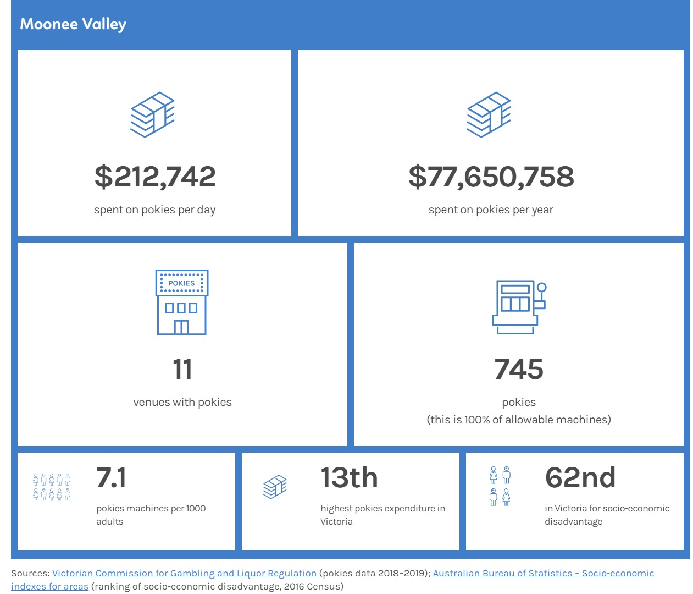

```{r, include = FALSE}
# libraries
pacman::p_load(tidyverse, janitor, readxl, ggpubr, flextable, officer, officedown, scales, glue, sf,
               cartography, captioner, lubridate, ggrepel, tidytext)

#knit options - turns off everything
knitr::opts_chunk$set(echo=FALSE, warning=FALSE, message=FALSE, fig.width = 7)

# colours
fair_red <-  "#E55048"
  
colour_table <- tibble(theme = c("Fair", "Thriving", "Connected", "Green", "Beautiful"),
                       col_code = c("#E55048", "#31788F", "#6A4479", "#4EA546", "#E3A51E"))

mv2040_cols <- c("#E55048", "#31788F", "#6A4479", "#4EA546", "#E3A51E")
mv_corp_cols <- c("#004F71", "#FFCD00", "#41B6E6", "#FF6A13")
mf_cols <- c("#E55048", "#41B6E6", "#E3A51E")
```


# Acknowledgements

Acknowledgement of country

Other

Other

Women’s health sector

Artist (artwork)


November 2020

\pagebreak

# Executive summary

Some sort of infographic like the previous health tracker

\pagebreak

# Abbreviations

ABS - Australian Bureau of Statistics

AHPC - Australian Health Policy Collaboration 

AIHW - Australian Institute of Health and Welfare

CI - Confidence interval (to indicate the level of uncertainty in estimates)

DHHS - Department of Health and Human Services (Victoria)

IRSD - Index of Relative Socio-economic Disadvantage (this is one of the four SEIFA indices)

SA2 - Statistical Area Level 2 (this is a geographical area that is part of the Australian Statistical Geography Standard)

SEIFA - Socio-Economic Indexes for Areas - these are indices created by the ABS

\pagebreak

# Background

Legislative requirements

2016 health profile?

MV2040: a neighbourhood approach to health and wellbeing

How to use this document (purpose, aim, approach, data available/LGA/neighbourhood level, gender/COVID/Aboriginal and Torres Strait Islander health, format, definitions, references) 

\pagebreak

# Introduction (indigenous language)

within the document, interleave with diagrams from https://www.aihw.gov.au/reports-data/australias-health

\pagebreak

# Location

add map - just take from MV2040 (p 32)

\pagebreak

# Population and growth (indigenous language)

## Current and projected populations

```{r}
pop_hh_raw <- read_excel("data_in/Forecast.id update (December 2017 update).xlsx", sheet = "Population and households") %>% 
  clean_names()

mv_pop_hh <- pop_hh_raw %>% 
  filter(area == "City of Moonee Valley", data_type %in% c("Total Population", "Households"))
```

The population of the City of Moonee Valley is forecast to increase from approximately 130,000 residents in 2019, to around 170,000 in 2040.

```{r, fig.width=7, fig.height=3}
ggplot(mv_pop_hh, aes(year, number, colour = data_type)) +
  geom_point() + geom_line() + 
  theme_pubclean() +
  scale_colour_manual(values = mv2040_cols) +
  theme(legend.position = c(0.8, 0.15)) + guides(colour = guide_legend(nrow = 1)) + 
  scale_y_continuous(labels = comma, limits = c(0, 180000)) + 
  labs(title = "Moonee Valley's population is growing", 
       subtitle = "Forecast households and population, 2016-2041", x = NULL, y = NULL, colour = NULL,
       caption = "Source: .id consulting, Moonee Valley Population Forecasts, 2017")
ggsave("graphs_out/forecast_pop.eps") # eps for illustrator 
```

## Age breakdown

```{r}
# data from abs - regional population by age and sex

# column names
ages <- c("0-4", "5–9", "10–14", "15–19", "20–24", "25–29", "30–34", "35–39", "40–44", "45–49", "50–54", "55–59", "60–64", "65–69", "70–74", "75–79", "80–84", "85+")

sa2_col_names <- c("S/T code", "S/T name", "GCCSA code", "GCCSA name",
                   "SA4 code", "SA4 name", "SA3 code", "SA3 name", "SA2 code", "SA2 name")

lga_col_names <- c("S/T code", "S/T name", "LGA code", "LGA name")

# just victorian sa2s
abs_age_sex_sa2 <- read_excel("data_in/abs_age_sex/32350ds0001_2019.xls", sheet = "Table 3",
           range = "A589:AB1050", col_names = c(sa2_col_names, ages))

# LGAs
abs_age_sex_lga <- read_excel("data_in/abs_age_sex/32350ds0003_2019.xls", sheet = "Table 3",
           range = "A11:V554", col_names = c(lga_col_names, ages)) 

# greater melbourne
greater_melb_age_sex <- abs_age_sex_sa2 %>% 
  filter(`GCCSA code` == "2GMEL") %>% 
  select(region = `GCCSA name`, `0-4`:`85+`) %>% 
  pivot_longer(-region, names_to = "age", values_to = "count") %>% 
  group_by(region, age) %>% 
  summarise(count = sum(count)) %>% 
  mutate(age = factor(age, levels = ages)) %>% 
  arrange(age) %>% 
  ungroup() %>% 
  mutate(pct = round(count/sum(count)*100, 1))

# moonee valley
mv_age_sex <- abs_age_sex_lga %>% 
  filter(`LGA name` == "Moonee Valley (C)") %>% 
  select(region = `LGA name`, ages) %>% 
  pivot_longer(-region, names_to = "age", values_to = "count") %>% 
  group_by(region, age) %>% 
  summarise(count = sum(count)) %>% 
  mutate(age = factor(age, levels = ages)) %>% 
  arrange(age) %>% 
  ungroup() %>% 
  mutate(pct = round(count/sum(count)*100, 1)) 

# join 
combined_age <- bind_rows(greater_melb_age_sex, mv_age_sex)
```

Data from the Australian Bureau of Statistics shows that Moonee Valley's population is slightly older than the population of Greater Melbourne. There are smaller proportions of young people and a higher proportion of older people.

```{r, fig.height=4.5, fig.width=7}
ggplot(combined_age, aes(age, pct, fill = rev(region))) + 
  theme_pubclean() + theme(strip.background = element_rect(fill="#fafafa")) + 
  geom_col() + facet_wrap(~region) + 
  geom_text(aes(label = pct, y = 0.5), col = "white", fontface = "bold") +
  scale_fill_manual(values = mv2040_cols) + theme(legend.position = "none") + coord_flip() +
  labs(title = "Moonee Valley's population is slightly older than Greater Melbourne's", 
       subtitle = "Population at 30 June 2019",
       x = "Age group", y = "Percentage", caption = "Source: ABS, Regional Population by Age and Sex, 2019")
ggsave("graphs_out/combined_age.eps") # eps for illustrator 
```


```{r}
# id information
age_5y_sex_raw <- read_excel("data_in/Forecast.id update (December 2017 update).xlsx", sheet = "Age (by sex - 5yr)") %>% 
  clean_names() %>% 
  rename(age_grp = age_group) %>% 
  mutate(age_grp = str_replace(age_grp, " years and over", " plus")) %>% 
  mutate(age_grp = str_replace(age_grp, " years", "")) %>% 
  mutate(age_grp = factor(age_grp, levels = c("0-4", "5-9", "10-14", "15-19", "20-24", "25-29", "30-34", "35-39", "40-44",
                                              "45-49", "50-54", "55-59", "60-64", "65-69",
                                              "70-74", "75-79", "80-84", "85 plus"))) %>% 
  filter(area == "City of Moonee Valley")
```

```{r}
#functions
#data by year
pp_year_data <- function(selected_year){
  age_5y_sex_raw %>% 
  filter(year == selected_year)  %>% 
  group_by(area) %>% 
  mutate(per_cent = number/sum(number)*100) %>% 
  mutate(per_cent = round(per_cent, 2)) %>% 
  mutate(per_cent_label = case_when(gender == "Female" ~ -per_cent,
                              TRUE ~ per_cent))
}

#data by neighbourhood
pp_nh_data <- function(selected_neighbourhood){
  age_5y_sex_raw %>% 
  filter(area == selected_neighbourhood)  %>% 
  filter(year %in% c(2020, 2025, 2030, 2035, 2040)) %>% 
  group_by(area, year) %>% 
  mutate(per_cent = number/sum(number)*100) %>% 
  mutate(per_cent = round(per_cent, 2)) %>% 
  mutate(per_cent_label = case_when(gender == "Female" ~ -per_cent,
                              TRUE ~ per_cent))
}

```

The population structure of the City of Moonee Valley is not forecast to change greatly between 2020 and 2040. However, there will be an increase the population of all age groups. There will be a slight increase in the median age and a greater proportion of older residents. This population increase will require an expansion of service provision to meet the needs of all these people. 

```{r, fig.height=4.25, fig.width=7}
# with numbers
pp_mv <- pp_nh_data("City of Moonee Valley") %>% 
  filter(year %in% c(2020, 2040))

pp_mv2 <- pp_mv %>% 
  mutate(number_label = if_else(gender == "Male", number, -number))

ggplot(pp_mv2, aes(age_grp, number_label, fill = gender)) +
  geom_bar(stat = "identity", width = 1) + 
  theme_pubclean() + theme(strip.background = element_rect(fill="#fafafa")) + 
  scale_y_continuous(breaks=c(-6000, -3000, 0, 3000, 6000), labels=c("6,000", "3,000", "0", "3,000", "6,000")) + 
  coord_flip() + 
  scale_fill_manual(values = mv2040_cols) + 
  labs(x = NULL, y = "Population", fill = NULL, title = "There will be more people in all age groups",
       subtitle = "Forecast population by year 2020 and 2040 (at 30 June)",
       caption = "Data source: .id consulting, Moonee Valley Population Forecasts, 2017") + 
  facet_wrap(~factor(year), ncol = 8) + theme(legend.position = "bottom") 
ggsave("graphs_out/pop_pyr_nums.eps") # eps for illustrator 
```

By neighbourhood, we can see that the highest proportions of those aged 65 years and over are in Milleara and Avondale Heights. Aberfeldie and Flemington have the highest proportions of young people.

```{r, fig.height= 5, fig.width=7}
age_5yr_raw <- read_excel("data_in/Forecast.id update (December 2017 update).xlsx", sheet = "Age structure (5 year groups)") %>% 
  clean_names()

age_5yr_nh <- age_5yr_raw %>% 
  filter(str_detect(area, "Neighbourhood")) %>% 
  mutate(area = str_remove(area, " Neighbourhood")) %>% 
  mutate(area = str_replace(area, "/-", "/-\n")) %>% 
  select(-gender) %>% 
  mutate(age_gr2 = case_when(age_group %in% c("0-4 years", "5-9 years ", "10-14 years", "15-19 years ", "20-24 years") ~ "0-24",
                             age_group %in% c("65-69 years", "70-74 years", "75-79 years",
                                              "80-84 years", "85 years and over") ~ "65+",
                             TRUE ~ "25-64")) %>% 
  filter(year == 2020) %>% 
  group_by(area, age_gr2) %>% 
  summarise(number = sum(number)) %>% 
  ungroup() %>% 
  group_by(area) %>% 
  mutate(pct = round(number/sum(number)*100,1))

ggplot(age_5yr_nh, aes(fct_rev(area), pct, fill = age_gr2)) +
  geom_col(position = position_stack(reverse = TRUE))  + theme(legend.position="none") +
  theme_pubclean() + coord_flip() +
  scale_fill_manual(values = mv2040_cols) +
  geom_text(data = age_5yr_nh %>% filter(age_gr2 == "0-24"), aes(label = pct, y = 5), col = "white", fontface = "bold") +
  geom_text(data = age_5yr_nh %>% filter(age_gr2 == "25-64"), aes(label = pct, y = 50), col = "white", fontface = "bold") +
  geom_text(data = age_5yr_nh %>% filter(age_gr2 == "65+"), aes(label = pct, y = 95), col = "white", fontface = "bold") +
  labs(title = "Milleara has the greatest population of older adults",
       subtitle = "Estimated population 30 June 2020 by age and neighbourhood",
       caption = "Data source: .id consulting, Moonee Valley Population Forecasts, 2017",
       x = NULL, y = "Percentage of neighbourhood population", fill = "Age group") +
  theme(legend.position = "bottom")
ggsave("graphs_out/pop_age_nhood_2020.eps") # eps for illustrator 

```

```{r}
age_5yr_nh_2040 <- age_5yr_raw %>% 
  filter(str_detect(area, "Neighbourhood")) %>% 
  mutate(area = str_remove(area, " Neighbourhood")) %>% 
  mutate(area = str_replace(area, "/-", "/-\n")) %>% 
  select(-gender) %>% 
  mutate(age_gr2 = case_when(age_group %in% c("0-4 years", "5-9 years ", "10-14 years", "15-19 years ", "20-24 years") ~ "0-24",
                             age_group %in% c("65-69 years", "70-74 years", "75-79 years",
                                              "80-84 years", "85 years and over") ~ "65+",
                             TRUE ~ "25-64")) %>% 
  filter(year == 2040) %>% 
  group_by(area, age_gr2) %>% 
  summarise(number = sum(number)) %>% 
  ungroup() %>% 
  group_by(area) %>% 
  mutate(pct = round(number/sum(number)*100,1))

ggplot(age_5yr_nh_2040, aes(fct_rev(area), pct, fill = age_gr2)) +
  geom_col(position = position_stack(reverse = TRUE))  + theme(legend.position="none") +
  theme_pubclean() + coord_flip() +
  scale_fill_manual(values = mv2040_cols) +
  geom_text(data = age_5yr_nh_2040 %>% filter(age_gr2 == "0-24"), aes(label = pct, y = 5), col = "white", fontface = "bold") +
  geom_text(data = age_5yr_nh_2040 %>% filter(age_gr2 == "25-64"), aes(label = pct, y = 50), col = "white", fontface = "bold") +
  geom_text(data = age_5yr_nh_2040 %>% filter(age_gr2 == "65+"), aes(label = pct, y = 95), col = "white", fontface = "bold") +
  labs(title = "The population will age in all neighbourhoods",
       subtitle = "Estimated population 30 June 2040 by age and neighbourhood",
       caption = "Data source: .id consulting, Moonee Valley Population Forecasts, 2017",
       x = NULL, y = "Percentage of neighbourhood population", fill = "Age group") +
  theme(legend.position = "bottom")
ggsave("graphs_out/pop_age_nhood_2040.eps") # eps for illustrator 
```


## Cultural and linguistic diversity (Indigenous language)

### Indigenous population

At the 2016 Census, there were 430 residents who identified as Aboriginal and/or Torres Strait Islander people. This was equal to 0.4 per cent of the Moonee Valley population at the time and is similar to neighbouring municipalities (0.5 per cent in both Moreland and in Maribyrnong). Census data also shows other differences between the Indigenous and non-Indigenous population in Moonee Valley:

* a lower median age (28 years) for the indigenous population compared to the non-Indigenous population (38 years)
* lower Year 12 completion rate (53 per cent compared to 66 per cent)
* a higher proportion renting (59 per cent compared to 32 per cent)

```{r, fig.width=5, fig.height=2.5}
atsi_pop <- tibble(year = c(2001L, 2006L, 2011L, 2016L),
  population = c(273L, 324L, 317L, 430L)) %>% 
  mutate(year = factor(year))

ggplot(atsi_pop, aes(year, population, fill = fair_red, label = population)) +
  geom_col() + 
  theme_pubclean() +
  theme(legend.position = "none") + 
  scale_y_continuous(limits = c(0, 500)) +
  geom_text(aes(label = population, vjust = 1.2), col = "white", fontface = "bold") +
  labs(title = "The indigenous population has been increasing", 
       subtitle = "Aboriginal and/or Torres Strait Islander population", x = NULL, y = "Population", colour = NULL,
       caption = "Source: ABS, Census 2016")
ggsave("graphs_out/pop_indigenous.eps") # eps for illustrator 
```

\pagebreak

### Languages spoken at home (Indigenous language)

The most common languages spoken at home (other than English) by residents of the City of Moonee Valley are Italian, Greek, Vietnamese, Mandarin, Cantonese and Arabic.

```{r}
lanp_2016 <- read_csv("data_in/MV_LANP_2016.csv", skip = 10) %>% 
  clean_names() %>% 
  select(lang = lanp_4_digit_level, count) %>% 
  filter(lang != "Total") %>% 
  filter(!is.na(lang)) 

top_lang <- lanp_2016 %>% 
  arrange(desc(count)) %>% 
  mutate(pct = round(count/sum(count)*100,1)) %>% 
  filter(lang != "Not stated") %>% 
  head(12) %>% 
  rename(`Language spoken at home` = lang, Residents = count, Percentage = pct) %>% 
  mutate(Residents = comma(Residents))

# for next bit
top_languages <- lanp_2016  %>% 
  arrange(desc(count))  %>% 
  filter(lang != "Not stated" & lang != "English") %>% 
  select(lang) %>% 
  head(12) %>% 
  pull()

# for table
top_lang  %>% 
  flextable() %>% 
  autofit() %>% 
  add_header_lines(values = "Top languages spoken at home, Moonee Valley") %>% 
  theme_vanilla() %>%
  align(i = NULL, j = c(2,3), align = "right", part = "body") %>% 
  footnote( i = 1, j = 1:2,
            value = as_paragraph(
              c("Source, ABS, Census 2016")
            ),
            ref_symbols = c(""),
            part = "header")
```

\pagebreak

### Proficiency in spoken English

Those who spoke Hindi at home were more likely to also have good levels of spoken English. Census data shows that for Moonee Valley residents, for the most common languages other than English, those who spoke Hindi, Maltese, and Turkish were the most likely to also speak English 'Very well'.

```{r, fig.height=4.25, fig.width=7}
lanp_engp_2016_raw <- read_csv("data_in/MV_LANP_by_ENGP_2016.csv", skip = 10) %>% 
  clean_names() %>% 
  select(lanp = lanp_4_digit_level, engp = engp_proficiency_in_spoken_english, count)

lanp_engp <- lanp_engp_2016_raw %>% 
  filter(engp != "Not applicable") %>% 
  mutate(engp = case_when(engp == "Not stated - both language (LANP) and proficiency (ENGP) not stated" ~ "Not stated",
                          engp == "Not stated - language (LANP) stated, proficiency (ENGP) not stated" ~ "Not stated",
                          TRUE ~ engp)) %>% 
  group_by(lanp, engp) %>% 
  summarise(count = sum(count)) %>% 
  ungroup() %>% 
  group_by(lanp) %>% 
  mutate(total = sum(count)) %>% 
  ungroup() %>% 
  arrange(desc(total)) %>% 
  mutate(pct = round(count/total*100, 1)) %>% 
  filter(lanp != "Not stated" & lanp != "English") %>% 
  filter(total > 0) %>% 
  arrange(desc(total)) %>% 
  filter(lanp %in% top_languages) %>% 
  mutate(engp = factor(engp, levels = c("Not stated", "Not at all", "Not well", "Well", "Very well"))) 

ggplot(lanp_engp, aes(reorder(lanp, total), pct, fill = engp)) +
  geom_col() +
  theme_pubclean() + coord_flip() +
  scale_fill_manual(values = rev(mv2040_cols)) +
  labs(title = "Self-assessed English profiency differs",
       subtitle = "By language spoken at home (top 12 languages other than English)",
       caption = "Data source: ABS, Census 2016",
       x = NULL, y = "Percentage", fill = NULL) +
  theme(legend.position = "bottom") + guides(fill = guide_legend(reverse=TRUE))
ggsave("graphs_out/self_assessed_eng.eps") # eps for illustrator 
```

### Multiculturalism makes Moonee Valley a better place to live

Data from the Moonee Valley Community Survey shows that about six in ten residents value the multiculturalism in Moonee Valley. This was higher amongst females than males, and also higher in areas like Flemington and Ascot Vale where the population is more culturally diverse.

```{r, fig.width=7, fig.height=2}
multiculturalism <- tibble(
        year = c(2020L, 2019L),
         pct = c(62.1, 60.7),
       ll = c(59.03656597, 57.55644629),
       ul = c(65.06365579, 63.81469496)) %>% 
  mutate(year = factor(year))

ggplot(multiculturalism, aes(year, pct, fill = fair_red)) + 
  theme_pubclean() + coord_flip() +
  geom_col() + geom_errorbar(aes(ymin = ll, ymax = ul, width=.1)) + 
  geom_text(aes(label = pct, y = 4), col = "white", fontface = "bold") +
  theme(legend.position = "none") +
  labs(title = "About six in ten residents value the multiculturalism in Moonee Valley",
      subtitle = "Agreement that they 'value living in Moonee Valley because of its multiculturalism", 
       x = NULL, y = "Percentage (with 95% CI)", caption = "Source: Moonee Valley Community Survey, 2020")
ggsave("graphs_out/multiculturalism.eps") # eps for illustrator 
```

## Education

Data from the 2016 Census shows that about 30 per cent of Moonee Valley residents are attending an educational institution. About 24 per cent of these were in primary school, while 20 per cent were in secondary school and 26 per cent were in a tertiary or technical institution. A lower proportion of primary school students are in government schools (10.9 per cent) when compared to Greater Melbourne (16.8 per cent).

```{r, fig.width=7, fig.height=4.5}
ed_levels <- c("Preschool", "Primary - Government","Primary - Catholic", "Primary - other non Government",
                     "Secondary - Government", "Secondary - Catholic","Secondary - other non Government",
                          "Technical or further education institution", "University or tertiary institution","Other","Not stated")

ed_raw <- tibble(education = ed_levels,
  `Moonee Valley (C)` = c(4.9,10.9,10.6,2.9,8.4, 7.2,4,4.6,21.5,3.3,21.8),
    `Greater Melbourne` = c(5.2,16.8,5.3,3,10.6,4.5,4.3,5.7,20.4,3.5,20.5))  %>% 
  pivot_longer(-education, names_to = "region", values_to = "value")%>% 
  mutate(education = factor(education, levels = ed_levels))

ggplot(ed_raw, aes(fct_rev(education), value, fill = region)) + 
  theme_pubclean() +
  geom_col() + facet_wrap(~region) + theme(strip.background = element_rect(fill="#fafafa")) + 
  geom_text(aes(label = value, hjust = -0.05), col = "black", fontface = "bold") + coord_flip() +
  scale_fill_manual(values = rev(mv2040_cols[1:2])) + ylim(0, 35) +
  labs(title = "A quarter of those in school are at primary school",
       subtitle =  "Attending an educational institution", fill = NULL,
       x = NULL, y = "Percentage", caption = "Source: ABS, Census 2016") + 
  theme(legend.position = "none") +
  guides(fill = guide_legend(nrow = 3)) + guides(fill = guide_legend(reverse=TRUE))
ggsave("graphs_out/education.eps") # eps for illustrator 
```


Data from the 2016 Census shows that there are higher levels of educational attainment in Moonee Valley when compared to Greater Melbourne. About 31 per cent of residents in Moonee Valley have a bachelor degree or higher, compared to 27.5 per cent for Greater Melbourne. 

```{r}
heap_levels <- c("Bachelor Degree level and above","Advanced Diploma and Diploma level", 
                 "Certificate level IV","Certificate level III",
                 "Year 12","Year 11","Year 10","Certificate level II",
                 "Certificate level I","Year 9 or below","No educational attainment","Not stated")

heap_raw <- tibble(level = heap_levels,
                      `Moonee Valley (C)` = c(31.1,9,2.2,8.9, 16.3,5.1,5.7,0,0,8.7,1.3,9.3),
                        `Greater Melbourne` = c(27.5,9.5,2.6,10.2,17.2,5.6,6.8,0.1,0,8,1.2,9.1)) %>% 
  pivot_longer(-level, names_to = "region", values_to = "value") %>% 
  mutate(level = factor(level, levels = heap_levels))

ggplot(heap_raw, aes(fct_rev(level), value, fill = region)) + 
  theme_pubclean() +
  geom_col() + facet_wrap(~region) + theme(strip.background = element_rect(fill="#fafafa")) + 
  geom_text(aes(label = value, hjust = -0.05), col = "black", fontface = "bold") + coord_flip() +
  scale_fill_manual(values = rev(mv2040_cols[1:2])) + ylim(0, 35) +
  labs(title = "About 31 per cent of residents have degrees",
       subtitle =  "Highest level of educational attainment", fill = NULL,
       x = NULL, y = "Percentage", caption = "Source: ABS, Census 2016") + 
  theme(legend.position = "none") +
  guides(fill = guide_legend(nrow = 3)) + guides(fill = guide_legend(reverse=TRUE))
ggsave("graphs_out/educational_attainment.eps") # eps for illustrator 
```


## Self-reported health

Data from the Victorian Population Health Survey 2017 shows that about 47.5 per cent of Moonee Valley residents reported either 'excellent' or 'very good' health. This is higher than for Victoria and the Western Melbourne Area (approximately 42 per cent).

```{r, fig.height=2.5, fig.width=7}
# function more just for single plots
vphs_ggplot_function <- function(dataset, title_text, yval = 2.5,  subtitle_text = NULL,
                                 caption_text = "Source: DHHS, Victorian Population Health Survey, 2017"){
  ggplot(dataset, aes(fct_rev(region), pct, fill = region)) + 
  theme_pubclean() + 
  geom_col() + geom_errorbar(aes(ymin = ll, ymax = ul, width=.1)) + coord_flip() +
  geom_text(aes(label = pct, y = yval), col = "white", fontface = "bold") +
  scale_fill_manual(values = mv2040_cols) + theme(legend.position = "none") + 
  labs(title = title_text, subtitle = subtitle_text,
       x = NULL, y = "Percentage (with 95% CI)",
       caption = caption_text)
}

vphs_srhealth <- read_csv("data_in/vphs/vphs_srhealth.csv") %>%  # anxiety or depression
  filter(selections == "Excellent / very good")

vphs_ggplot_function(dataset = vphs_srhealth, yval = 2, title_text = "Moonee Valley's population reports better health levels",
                     subtitle_text = "Self-reported health (Excellent or very good health status)")
ggsave("graphs_out/health_status.eps") # eps for illustrator 
```

The same data shows that women in Moonee Valley were more likely to self-report higher levels of health than males. About 42 per cent of men and 54 per cent of women reported ‘excellent’ or ‘very good’ levels of health.

```{r, fig.height=2.5, fig.width=7}
vphs_srh_gender <- tibble(
            gender = c("Women", "Women", "Women", "Men", "Men", "Men"),
         selection = c("Excellent/Very good","Good",
                       "Fair/Poor","Excellent/Very good","Good","Fair/Poor"),
               pct = c(53.7, 27.9, 18.2, 41.1, 42.3, 16.6),
                ll = c(46, 21.8, 13.2, 32.7, 33.9, 11),
                ul = c(61.3, 35, 24.6, 50, 51.2, 24.3)) %>% 
  mutate(selection = factor(selection, levels = c("Excellent/Very good","Good", "Fair/Poor")))

ggplot(vphs_srh_gender, aes(fct_rev(selection), pct, fill = selection)) + 
  theme_pubclean() + theme(strip.background = element_rect(fill="#fafafa")) + 
  geom_col() + geom_errorbar(aes(ymin = ll, ymax = ul, width=.1)) + facet_wrap(~gender, ncol = 3) +
  geom_text(aes(label = pct, y = 5), col = "white", fontface = "bold") +
  scale_fill_manual(values = mv2040_cols) + theme(legend.position = "none") + coord_flip() +
  labs(title = "Women report better health levels than men", 
       subtitle = "Self-reported health status by gender, Moonee Valley", 
       x = NULL, y = "Percentage (with 95% CI)", caption = "Source: DHHS, Victorian Population Health Survey, 2017")
ggsave("graphs_out/health_status_gender.eps") # eps for illustrator 
```

\pagebreak

# Environmental factors (Indigenous language)

## Socio-economic disadvantage

```{r}
# 2016 seifa irsd by lga - export from abs.stat
irsd_lga_raw <- read_csv("data_in/SEIFA2016IRSD_LGA.csv") %>% 
  clean_names()

seifa_table <- irsd_lga_raw %>% 
  filter(measure %in% c("Score", "Rank within State or Territory",
                        "Rank within State or Territory - Decile", "Rank within State or Territory - Percentile")) %>% 
  select(lga = local_government_areas_2016, index_type, measure, value) %>% 
  
  filter(lga == "Moonee Valley (C)") %>% 
  select(-lga) %>% 
  mutate(measure = case_when(measure == "Rank within State or Territory - Decile" ~ "Decile",
                             measure == "Rank within State or Territory - Percentile" ~ "Percentile",
                             TRUE ~ measure)) %>% 
  mutate(measure = if_else(measure == "Rank within State or Territory", "Rank", measure)) %>% 
  mutate(index_type = str_remove(index_type, "Index of ")) %>% 
  pivot_wider(index_type, names_from = measure, values_from = value) %>% 
  rename(Index = index_type)
```

Data from the various Socio-Economic Indexes for Areas (SEIFA) indices show that overall Moonee Valley is fairly well advantaged when we compare it to other local government areas in Victoria. Moonee Valley is in ninth decile (ten equal groups, with decile 1 being the most disadvantaged) for the Index of Education and Occupation  and the Index of Relative Socio-Economic Advantage and Disadvantage. Moonee Valley is also in the eighth decile on the Index of Relative Socio-Economic Disadvantage and the seventh decile for the  Index of Economic Resources.  

\  

```{r}
seifa_table %>% 
  flextable()  %>% 
  autofit() %>% 
  add_header_lines(values = "Socio-Economic Indexes for Areas (SEIFA) indices, Moonee Valley") %>% 
  theme_vanilla() %>% 
  fontsize(i = NULL, j = NULL, size = 10, part = "body") %>% 
  footnote( i = 1, j = 1:4,
            value = as_paragraph(
              c("Source: ABS, Census 2016; (comparisons with other municipalities in Victoria)")
            ),
            ref_symbols = c(""),
            part = "header")
```

\  

```{r}
irsd_raw <- read_csv("data_in/SEIFA2016IRSD.csv") %>%
  clean_names() %>%
  rename(sa1 = sa1_7digit_code_2016, nh = neighbourhood, pop = usual_resident_population) %>%
  mutate(nh = str_to_title(nh)) %>%
  mutate(nh = str_replace_all(nh, "/", "-\n")) %>%
  mutate(sa1 = as.character(sa1))

irsd_nh <- irsd_raw %>%
  select(-sa1, -score) %>%
  group_by(nh, decile) %>%
  summarise(pop = sum(pop)) %>%
  ungroup %>%
  group_by(nh) %>%
  mutate(prop = pop/sum(pop))
# 
# sa1_shp <- st_read("data_in/shp/SA1_2016_MV.shp", quiet = TRUE) %>% 
#   clean_names() %>% 
#   select(sa1 = sa1_7digit)
# 
# seifa_shp <- sa1_shp %>% 
#   left_join(irsd_raw, by = "sa1") %>% 
#   select(sa1, decile) %>% 
#   filter(!is.na(decile))
```

However, the SEIFA Index of Relative Socio-economic Disadvantage (IRSD) also shows that there is great economic diversity in Moonee Valley households. Here the scores are split in to deciles (each comprising ten per cent of scores, with decile 1 being the most disadvantaged). There are pockets of disadvantage in neighbourhoods like Flemington, Ascot Vale, Avondale Heights and Milleara with many area in the most disadvantaged deciles. In contrast, Strathmore and Strathmore Heights are the least disadvantaged neighbourhoods with all of the population in the least disadvantaged deciles. Some areas in Flemington and Ascot vale (the public housing estates) are some of the most disadvantaged in Victoria.

```{r, fig.height= 6, fig.width=7}
ggplot(irsd_nh, aes(decile, prop)) +
  geom_col(fill = "#E55048") + facet_wrap(~nh, nrow =4) + theme(legend.position="none") +
  theme_pubclean() + theme(strip.background = element_rect(fill="#fafafa")) + 
  labs(title = "Disadvantage is concentrated in certain neighbourhoods",
       subtitle = "SEIFA Index of Relative Socio-economic Disadvantage (IRSD) by neighbourhood", caption = "Data source: ABS, Census 2016",
       x = "SEIFA IRSD decile (1 = most disadvantaged, 10 = least disadvantaged)", y = "Percentage of neighbourhood population") + 
  scale_x_continuous(breaks=c(seq(1,10,1))) + scale_y_continuous(labels = percent)
ggsave("graphs_out/seifa_nhood.eps") # eps for illustrator 
```

This disparity disadvantage is shown in the map below. The greatest concentrations of disadvantage in Moonee Valley are one the public housing estates in Flemington and Ascot Vale.


```{r}
# plot(st_geometry(seifa_shp), col = NA, border = NA, bg = "white")
# # plot population density
# choroLayer(
#   x = seifa_shp, 
#   var = "decile",
#   method = "pretty",
#   nclass=5,
#   col = rev(carto.pal(pal1 = "orange.pal", n1 = 5)),
#   border = "white", 
#   lwd = 0.5,
#   legend.pos = "topright", 
#   legend.title.txt = "SEIFA IRSD decile",
#   add = TRUE
# ) 
# # layout
# layoutLayer(title = "IRSD decile by SA1", 
#             sources = "Source: ABS, 2016",
#             frame = FALSE, north = FALSE, tabtitle = TRUE, col = "white", coltitle = "black") 
# # north arrow
# north(pos = "topleft")
```


## Heat Vulnerability Index

The Heat Vulnerability Index measures the impact of the Urban Heat Island effect on vulnerable populations. Within Moonee Valley, the most vulnerable areas are in the east of the municipality, where there is a higher concentration of older adults.

```{r}
# hvi_shp <- st_read("data_in/shp/HEAT_VULNERABILITY_INDEX_2018.shp", quiet = TRUE) %>% 
#   clean_names() %>% 
#   filter(sa3_name16 %in% c("Essendon", "Keilor")) %>% 
#   filter(!sa2_name16 %in% "Keilor") %>% 
#   select(sa1 = sa1_7dig16, hvi_index, pop_dens = popu_dens)
```


## Open space

refer to new strategy when it is available - speak to Julie Fr

## Tree canopy cover

perhaps Evie has a map

```{r}
# plot(st_geometry(hvi_shp), col = NA, border = NA, bg = "white")
# # plot population density
# choroLayer(
#   x = hvi_shp, 
#   var = "hvi_index",
#   method = "equal",
#   nclass=5,
#   col = carto.pal(pal1 = "orange.pal", n1 = 5),
#   border = "white", 
#   lwd = 0.5,
#   legend.pos = "topright", 
#   legend.title.txt = "Heat Vulnerability",
#   add = TRUE
# ) 
# # layout
# layoutLayer(title = "Heat Vulnerability Index by SA1", 
#             sources = "Source: DELWP, 2019",
#             frame = FALSE, north = FALSE, tabtitle = TRUE, col = "white", coltitle = "black") 
# # north arrow
# north(pos = "topleft")
```

## Walkability (Indigenous language)

* See what Evie has done. Otherwise, just use the ones from MV2040 (page 65 - but also page 86 perhaps?)

\pagebreak

# Gender inequality (Indigenous language)

```{r}
census_wk_inc <- read_csv("data_in/census/2016Census_G17A_VIC_LGA.csv") %>% 
  left_join(read_csv("data_in/census/2016Census_G17B_VIC_LGA.csv")) %>% 
  left_join(read_csv("data_in/census/2016Census_G17C_VIC_LGA.csv")) %>% 
  clean_names() %>% 
  pivot_longer(-lga_code_2016, names_to = "category", values_to = "count") %>% 
  filter(lga_code_2016 == "LGA25060") %>% 
  mutate(gender = str_sub(category, 1,1)) %>% 
  mutate(cat = str_sub(category, 3, -1)) %>% 
  select(-category) %>% 
  filter(str_ends(cat, "tot")) %>% 
  filter(cat != "tot") %>% 
  mutate(cat = str_remove(cat, "_tot")) %>% 
  mutate(cat2 = case_when(cat %in% c("1250_1499", "1500_1749", "1750_1999", "2000_2999", "3000_more") ~ "Weekly income greater than $1250",
                          TRUE ~ "Weekly income less than $1250")) %>% 
  group_by(gender, cat2) %>% 
  summarise(count = sum(count)) %>% 
  mutate(pct = round(count/sum(count)*100,1)) %>% 
  filter(gender %in% c("f", "m")) %>% 
  mutate(gender = if_else(gender == "f", "Female", "Male")) 

census_unpwork <- read_csv("data_in/census/2016Census_G20A_VIC_LGA.csv") %>% 
  left_join(read_csv("data_in/census/2016Census_G20B_VIC_LGA.csv")) %>% 
  clean_names() %>% 
  pivot_longer(-lga_code_2016, names_to = "category", values_to = "count") %>% 
  filter(lga_code_2016 == "LGA25060") %>% 
  mutate(gender = str_sub(category, 1,1)) %>% 
  mutate(cat = str_sub(category, 3, -1)) %>% 
  select(-category) %>% 
  filter(str_starts(cat, "tot")) %>% 
  filter(cat != "tot_total") %>% 
  mutate(cat = str_remove(cat, "tot_")) %>% 
  mutate(cat2 = case_when(cat %in% c("dudw_30_h_mo", "dudw_15_29_h") ~ "Did 15+ hours of unpaid work/week",
                          TRUE ~ "Did fewer than 15 hours of unpaid work/week")) %>% 
  group_by(gender, cat2) %>% 
  summarise(count = sum(count)) %>% 
  mutate(pct = round(count/sum(count)*100,1)) %>% 
  filter(gender %in% c("f", "m")) %>% 
  mutate(gender = if_else(gender == "f", "Female", "Male")) 

census_lfp <- read_csv("data_in/census/2016Census_G40_VIC_LGA.csv") %>% 
  clean_names() %>% 
  pivot_longer(-lga_code_2016, names_to = "category", values_to = "count") %>% 
  filter(lga_code_2016 == "LGA25060") %>% 
  mutate(gender = str_sub(category, -1,-1)) %>% 
  filter(str_detect(category, "percnt_lab_forc_prticipation")) %>% 
  mutate(cat2 = "Labour force participation rate") %>% 
  select(-category, -lga_code_2016) %>% 
  filter(gender %in% c("f", "m")) %>% 
  mutate(gender = if_else(gender == "f", "Female", "Male")) %>% 
  rename(pct = count)

census_ineq <- bind_rows(census_wk_inc, census_unpwork, census_lfp) %>% 
  filter(!cat2 %in% c("Weekly income less than $1250", "Did fewer than 15 hours of unpaid work/week")) %>% 
  select(-count)
```

Data from the 2016 Census shows that females do more unpaid work (housework), while having lower incomes and being less likely to participate in the labour force. The labour force participation rate is the proportion of the population aged 15 years and over that are in the labour force (i.e. either in work, or looking for work).

```{r, fig.height=3, fig.width=7}
ggplot(census_ineq, aes(fct_rev(cat2), pct, fill = gender)) + 
  theme_pubclean() +
  geom_col(position = "dodge") +
  geom_text(aes(label = pct, y = 3), col = "white", fontface = "bold", position = position_dodge(width = 1)) +
  scale_fill_manual(values = mv2040_cols) + theme(legend.position = c(0.8, 0.85)) + coord_flip() +
  labs(title = "Women face labour force and unpaid work inequality", fill = NULL,
       x = NULL, y = "Percentage", caption = "Source: ABS, Census 2016") +
  guides(fill = guide_legend(nrow = 1))
ggsave("graphs_out/gender_inequality.eps") # eps for illustrator 
```

\pagebreak


\pagebreak

# Housing (Indigenous language)

## Dwelling structure

The majority of dwellings in Moonee Valley are separate houses. They make up 57 per cent of dwellings (compared to 68 per cent in Greater Melbourne), with semi-detached and flats each making up 21 per cent. 

```{r, fig.width=7, fig.height=3.5}
strd_levels <- c("Separate house","Semi-detached","Flat or apartment","Other dwelling")

strd_raw <- tibble(structure = strd_levels,
  `Moonee Valley (C)` = c(57.4, 20.7, 21, 0.4),
    `Greater Melbourne` = c(67.8, 16.8, 14.7, 0.4)) %>% 
  pivot_longer(-structure, names_to = "region", values_to = "value") %>% 
  mutate(structure = factor(structure, levels = strd_levels))

ggplot(strd_raw, aes(fct_rev(structure), value, fill = region)) + 
  theme_pubclean() +
  geom_col() + facet_wrap(~region) + theme(strip.background = element_rect(fill="#fafafa")) + 
  geom_text(aes(label = value, hjust = -0.05), col = "black", fontface = "bold") + coord_flip() +
  scale_fill_manual(values = rev(mv2040_cols[1:2])) +
  labs(title = "Most dwellings are separate houses",
       subtitle =  "Dwelling structure", fill = NULL,
       x = NULL, y = "Percentage", caption = "Source: ABS, Census 2016") + 
  theme(legend.position = "none") + ylim(0,80)
ggsave("graphs_out/dwelling_structure.eps") # eps for illustrator 
```


## Tenure type

About two-thirds of dwellings are owned in Moonee Valley. Of these, 35 per cent are owned outright, while 29 per cent are owned with a mortgage. Another 32.5 per cent of homes are rented (of the rented dwellings, about 14 per cent are social housing). There are a higher proportion of those who own their home outright in Moonee Valley compared to Greater Melbourne, and also a higher proportion of those rented dwellings.

```{r, fig.width=7, fig.height=3.5}
tend_levels <- c("Owned outright", "Owned with a mortgage", "Rented", "Other tenure type", "Tenure type not stated")

tend_raw <- tibble(tenure = tend_levels,
  `Moonee Valley (C)` = c(35, 29.1, 32.5, 0.6, 2.9),
    `Greater Melbourne` = c(30.4, 36, 30, 0.8, 2.7)) %>% 
  pivot_longer(-tenure, names_to = "region", values_to = "value") %>% 
  mutate(tenure = factor(tenure, levels = tend_levels))

ggplot(tend_raw, aes(fct_rev(tenure), value, fill = region)) + 
  theme_pubclean() +
  geom_col() + facet_wrap(~region) + theme(strip.background = element_rect(fill="#fafafa")) + 
  geom_text(aes(label = value, hjust = -0.05), col = "black", fontface = "bold") + coord_flip() +
  scale_fill_manual(values = rev(mv2040_cols[1:2])) +
  labs(title = "About two-in-three homes are owned in Moonee Valley ",
       subtitle = "Tenure type", fill = NULL,
       x = NULL, y = "Percentage", caption = "Source: ABS, Census 2016") + 
  theme(legend.position = "none") + ylim(0, 40)
ggsave("graphs_out/tenure_type.eps") # eps for illustrator 
```


## Household structure 

Data from the 2016 Census shows that the most common household type is couples with children, who account for approximately 31 per cent of households. Lone person households make up about 25 per cent of households.

```{r, fig.width=7, fig.height=4}
# 2016 census data - edited extract from HDFMD
households <- tibble(household_type = c("Couples without children","Couples with children","One parent families",
                          "Other families","Lone person","Group household",
                          "Visitor only households","Other not classifiable"),
  `Moonee Valley (C)` = c(22.5, 30.7, 9.1, 2.7, 25, 4.7, 0.7, 4.7),
    `Greater Melbourne` = c(22.5, 32.5, 9.7, 3.2, 22, 4.7, 0.9, 4.5)) %>% 
  pivot_longer(-household_type, names_to = "region", values_to = "value")

ggplot(households, aes(fct_rev(household_type), value, fill = region)) + 
  theme_pubclean() +
  geom_col() + facet_wrap(~region) + theme(strip.background = element_rect(fill="#fafafa")) + 
  geom_text(aes(label = value, hjust = -0.05), col = "black", fontface = "bold") + coord_flip() +
  scale_fill_manual(values = rev(mv2040_cols[1:2])) + ylim(0, 35) +
  labs(title = "Couples with children make up 31% of households",
       subtitle =  "Household type", fill = NULL,
       x = NULL, y = "Percentage", caption = "Source: ABS, Census 2016") + 
  theme(legend.position = "none") +
  guides(fill = guide_legend(nrow = 3)) + guides(fill = guide_legend(reverse=TRUE))
ggsave("graphs_out/household_type.eps") # eps for illustrator 
```

## Affordable housing

According to the Rental Report from the Department of Health and Human Services, there were only 21 affordable lettings in Moonee Valley in June 2020. These are private rental properties (newly leased) affordable to households on statutory (Centrelink) incomes by bedroom number. There have been fewer than 30 affordable lettings in Moonee Valley since 2015. 

```{r, fig.height=4, fig.width=7}
rr_affordable_lga <- read_csv("data_in/dhhs_rental_report/lga_affordable.csv")

mv_affordable <- rr_affordable_lga %>% 
  filter(region == "Moonee Valley", type == "Affordable lettings") %>% 
  mutate(values = as.integer(values)) %>% 
  filter(bedrooms != "total") %>% 
  filter(month >= as.Date("2005-01-01"))

# # just a look at the totals
# rr_affordable_lga %>%
#   filter(region == "Moonee Valley", type == "Affordable lettings") %>%
#   mutate(values = as.integer(values)) %>%
#   filter(bedrooms == "total") %>%
#   tail(30)

ggplot(mv_affordable, aes(month, values, colour = bedrooms, label = values)) +
  geom_point() + geom_line() + 
  theme_pubclean() +
  scale_color_manual(values = mv2040_cols) +
  theme(legend.position = c(0.9, 0.8)) + 
  labs(title = "Few rentals in Moonee Valley are 'affordable'",
       subtitle = "Affordable lettings, City of Moonee Valley",
       x = NULL, y = "Dwellings", colour = NULL,
       caption = "Source: Rental Report, Department of Health and Human Services, 2020a")
ggsave("graphs_out/affordable_rentals.eps") # eps for illustrator 
```

## Homelessness

Data from the Australian Bureau of Statistics shows show little change in the number of homeless persons in Moonee Valley between 2011 and 2016. Across the country, the number of homeless persons has risen, but in Moonee Valley, there was a slight decline, with 403 homeless persons in 2016, compared to 409 in 2011. The figure for 2016 (403 persons) is 1.6 per cent of the all homeless persons in Victoria (24,828).

```{r}
tibble(Region = c("Australia", "Victoria", "Moonee Valley (C)"),
       `2011` = c(102439, 22259, 409),
       `2016` = c(116427, 24828, 403),
       `Change (#)` = c(13988, 2569, -6),
       `Change (%)` = c("14%", "12%", "-1%"))   %>% 
  mutate(`2011` = comma(`2011`)) %>% 
  mutate(`2016` = comma(`2016`)) %>% 
  mutate(`Change (#)` = comma(`Change (#)`)) %>% 
  flextable() %>% 
  autofit() %>% 
  add_header_lines(values = "Homelessness estimates, 2016") %>% 
  theme_vanilla() %>%
  align(i = NULL, j = c(2,4), align = "right", part = "body") %>% 
  footnote( i = 1, j = 1:4,
            value = as_paragraph(
              c("Source: ABS, Census 2016")
            ),
            ref_symbols = c(""),
            part = "header")
```

The largest concentrations of homeless residents are in Flemington, Ascot Vale and the Essendon - Aberfeldie area.

```{r}
tibble(SA2 = c("Flemington", "Ascot Vale", "Essendon - Aberfeldie", "Moonee Ponds",
               "Keilor East", "Airport West", "Strathmore", "Niddrie - Essendon West", "Essendon Airport"),
       `2011` = c(130L, 81L, 71L, 59L, 41L, 5L, 0L, 17L, 0L),
       `2016` = c(126L, 112L, 76L, 43L, 18L, 13L, 10L, 4L, 0L),
       `Change (#)` = c(-4L, 31L, 5L, -16L, -23L, 8L, 10L, -13L, 0L)) %>% 
  flextable() %>% 
  autofit() %>% 
  add_header_lines(values = "Homelessness estimates by SA2, 2016") %>% 
  theme_vanilla() %>%
  align(i = NULL, j = c(2,3), align = "right", part = "body") %>% 
  footnote( i = 1, j = 1:3,
            value = as_paragraph(
              c("Source: ABS, Census 2016")
            ),
            ref_symbols = c(""),
            part = "header")
```


\pagebreak

# Community Safety (Indigenous language)

Data from the Council's annual community survey shows that about 45 per cent of all residents feel safe walking alone in their local area at night. About eight in ten residents feel safe at public transport stops and stations, while about nine in ten residents feel safe when walking alone in their local area during the day.

```{r, fig.width=7, fig.height=4}
cs_safety <- read_csv("data_in/community_survey/safety_full_2020.csv")

cs_safety_mv <- cs_safety %>% 
  filter(cat == "Overall") %>% 
  filter(safety == "'Very safe' or 'safe'") %>% 
  mutate(name = str_replace(name, "your local", "your \nlocal")) %>% 
  mutate(name = str_replace(name, "stops and", "stops \nand"))

ggplot(cs_safety_mv, aes(year, pct, label = pct, colour = name)) +
  theme_pubclean() +
  geom_point() + geom_line()  + ylim(0, 100) + 
  geom_errorbar(aes(ymin = lower, ymax = upper, width=.05), colour = "darkgrey") +
  labs(title="Perceptions of safety depend on location",
       subtitle = "Perception of community safety (feeling 'very safe' or 'safe')",
       x = NULL, y = "Percentage (with 95% CI)", colour = NULL,
       caption = "Source: Moonee Valley Community Survey, 2020") +
  scale_color_manual(values = mv2040_cols) + scale_x_continuous(breaks = seq(2018, 2020, 1)) +
  theme(legend.position = "bottom") +
  geom_text_repel(show.legend = FALSE, nudge_y = 5)
ggsave("graphs_out/perception_safety.eps") # eps for illustrator 
```

Perceptions of safety of walking alone in the local area at night are much lower for females than for males. In 2020, only 38 per cent of females reported feeling either 'very safe' or 'safe' compared to 54 per cent for males. There is little difference between males and females for perceptions of safety at public transport stops as well as walking alone during the day.

```{r}
cs_safety_gender <- cs_safety %>% 
  filter(cat == "Gender") %>% 
  filter(safety == "'Very safe' or 'safe'") %>% 
  mutate(name = str_replace(name, "your local", "your \nlocal")) %>% 
  mutate(name = str_replace(name, "stops and", "stops \nand")) %>% 
  mutate(group = if_else(group == "Female", "Females", "Males"))

ggplot(cs_safety_gender, aes(year, pct, label = pct, colour = name)) +
  theme_pubclean() + theme(strip.background = element_rect(fill="#fafafa")) + 
  geom_point() + geom_line()  + ylim(0, 100) + facet_wrap(~group) +
  geom_errorbar(aes(ymin = lower, ymax = upper, width=.05), colour = "darkgrey") +
  labs(title="Females feel less safe at night",
       subtitle = "Perception of community safety (feeling 'very safe' or 'safe')",
       x = NULL, y = "Percentage (with 95% CI)", colour = NULL,
       caption = "Source: Moonee Valley Community Survey, 2020") +
  scale_color_manual(values = mv2040_cols) + scale_x_continuous(breaks = seq(2018, 2020, 1)) +
  theme(legend.position = "bottom") +
  geom_text_repel(show.legend = FALSE, nudge_y = 5)
ggsave("graphs_out/perception_safety_gender.eps") # eps for illustrator 
```

\pagebreak

# Employment (include Woi-wurrung language) 

## Employment type

Data from the 2016 Census shows that there are similar employment levels in Moonee Valley when compared to Greater Melbourne. About 60 per cent of those in the labour force work full time, while about 30 per cent work part time.

```{r, fig.width=7, fig.height=3.5}
empl_levels <- c("Worked full-time", "Worked part-time", "Away from work", "Unemployed")

empl_raw <- tibble(category = empl_levels,
  `Moonee Valley (C)` = c(59.2, 30.4, 4.7, 5.7),
    `Greater Melbourne` = c(58, 30.6, 4.6, 6.8)) %>% 
  pivot_longer(-category, names_to = "region", values_to = "value") %>% 
  mutate(category = factor(category, levels = empl_levels))

ggplot(empl_raw, aes(fct_rev(category), value, fill = region)) + 
  theme_pubclean() +
  geom_col() + facet_wrap(~region) + theme(strip.background = element_rect(fill="#fafafa")) + 
  geom_text(aes(label = value, hjust = -0.05), col = "black", fontface = "bold") + coord_flip() +
  scale_fill_manual(values = rev(mv2040_cols[1:2])) +
  labs(title = "About 59% of the labour force work full time",
       subtitle =  "Employment type for those in the labour force", fill = NULL,
       x = NULL, y = "Percentage", caption = "Source: ABS, Census 2016") + 
  theme(legend.position = "none") + ylim(0,80)
ggsave("graphs_out/empl_status.eps") # eps for illustrator 
```

Males in Moonee Valley are more likely to work full-time than females. About 71 per cent of males work full-time, compared to 47 per cent of females.

```{r, fig.width=7, fig.height=3.5}
empl_gender <- read_csv("data_in/census/lfsp_combined_gender_2016.csv", skip = 9) %>% 
  clean_names() %>% 
  filter(!is.na(count)) %>% 
  select(lfsp = lfsp_labour_force_status, sex = sexp_sex, region = lga_ur, count) %>% 
  mutate(lfsp2 = case_when(lfsp == "Employed, worked full-time" ~ "Worked full-time",
                          lfsp == "Employed, worked part-time" ~ "Worked part-time",
                          lfsp == "Employed, away from work" ~ "Away from work",
                          lfsp %in% c("Unemployed, looking for full-time work",
                                      "Unemployed, looking for part-time work") ~ "Unemployed",
                          TRUE ~ "Other")) %>% 
  group_by(region, sex, lfsp2) %>% 
  summarise(count = sum(count)) %>% 
  filter(lfsp2 != "Other") %>% 
  mutate(lfsp2 = factor(lfsp2, levels = empl_levels)) %>% 
  ungroup() %>% 
  group_by(region, sex) %>% 
  mutate(pct = round(count/sum(count)*100, 1)) %>% 
  rename(category = lfsp2, value = pct) %>% 
  mutate(sex = if_else(sex == "Female", "Females", "Males"))

ggplot(empl_gender, aes(fct_rev(category), value, fill = sex)) + 
  theme_pubclean() +
  geom_col() + facet_wrap(~sex) + theme(strip.background = element_rect(fill="#fafafa")) + 
  geom_text(aes(label = value, hjust = -0.05), col = "black", fontface = "bold") + coord_flip() +
  scale_fill_manual(values = mv2040_cols) +
  labs(title = "Males are much more likely to work full-time than females",
       subtitle =  "Employment type by gender for those in the labour force, Moonee Valley", fill = NULL,
       x = NULL, y = "Percentage", caption = "Source: ABS, Census 2016") + 
  theme(legend.position = "none") + ylim(0,80)
ggsave("graphs_out/empl_status_gender.eps") # eps for illustrator 
```


## Occupation

Data from the 2016 Census shows that about 29 per cent of Moonee Valley residents work in professional jobs, with another 15 per cent in managerial positions. This compares to 25 per cent and 13 per cent respectively for Greater Melbourne. The next most common occupation types are clerical and administrative workers, technicians and trades workers, sales workers, and community services workers.

```{r, fig.width=7, fig.height=3.5}
occ_levels <- c("Managers", "Professionals", "Technicians and Trades Workers", "Community and Personal Service Workers", "Clerical and Administrative Workers", "Sales Workers", "Machinery Operators and Drivers", "Labourers", "Inadequately described", "Not stated")

occ_raw <- tibble(category = occ_levels,
  `Moonee Valley (C)` = c(15, 29.3, 10.2, 9.5, 15.4, 9.6, 3.6, 5.7, 1.1, 0.7),
    `Greater Melbourne` = c(13.2, 25, 12.6, 10.2, 13.9, 9.7, 5.6, 8.1, 1, 0.7)) %>% 
  pivot_longer(-category, names_to = "region", values_to = "value") %>% 
  mutate(category = factor(category, levels = occ_levels))

occ_order <- occ_raw %>% 
  filter(region == "Moonee Valley (C)") %>% 
  arrange(value) %>% 
  mutate(order = row_number()) %>% 
  select(category, order)

occ_table <- left_join(occ_raw, occ_order)

ggplot(occ_table, aes(reorder(category, order), value, fill = region)) + 
  theme_pubclean() +
  geom_col() + facet_wrap(~region) + theme(strip.background = element_rect(fill="#fafafa")) + 
  geom_text(aes(label = value, hjust = -0.05), col = "black", fontface = "bold") + coord_flip() +
  scale_fill_manual(values = rev(mv2040_cols[1:2])) +
  labs(title = "Three-in-ten residents work in professional jobs",
       subtitle =  "Occupation of employed persons", fill = NULL,
       x = NULL, y = "Percentage", caption = "Source: ABS, Census 2016") + 
  theme(legend.position = "none") + ylim(0,80)
ggsave("graphs_out/occupation.eps") # eps for illustrator 
```

## Industry of employment

Data from the 2016 Census shows that the most common industries of employment for Moonee Valley residents are:

* Health care and Social Assistance (11.3 per cent of those employed)
* Education and training (10.3 per cent)
* Professional, Scientific and Technical Services (10.2 per cent)
* Retail Trade (9.5 per cent)

These top four industries are the same (in a different order) as for Greater Melbourne.

```{r, fig.width=7, fig.height=5}
indp_levels <- c("Agriculture, Forestry and Fishing", "Mining", "Manufacturing", "Electricity, Gas, Water and Waste Services", "Construction", "Wholesale Trade", "Retail Trade", "Accommodation and Food Services", "Transport, Postal and Warehousing", "Information Media and Telecommunications", "Financial and Insurance Services", "Rental, Hiring and Real Estate Services", "Professional, Scientific and Technical Services", "Administrative and Support Services", "Public Administration and Safety", "Education and Training", "Health Care and Social Assistance", "Arts and Recreation Services", "Other Services", "Inadequately described", "Not stated")

indp_raw <- tibble(category = indp_levels,
  `Moonee Valley (C)` = c(0.3, 0.2, 5.8, 0.9, 7.5, 2.9, 9.5, 5.9, 5.9, 2.3, 5.5, 1.8,
                          10.2, 3.4, 6.5, 10.3, 11.3, 2.7, 3.1, 2.9, 1.1),
    `Greater Melbourne` = c(0.6, 0.2, 7.7, 1, 8.2, 3.5, 10.1, 6.5, 5, 2.2, 4.5, 1.7,
                            9, 3.6, 5, 8.6, 12, 2.1, 3.6, 3.6, 1.3)) %>% 
  pivot_longer(-category, names_to = "region", values_to = "value") %>% 
  mutate(category = factor(category, levels = indp_levels))

indp_order <- indp_raw %>% 
  filter(region == "Moonee Valley (C)") %>% 
  arrange(value) %>% 
  mutate(order = row_number()) %>% 
  select(category, order)

indp_table <- left_join(indp_raw, indp_order)

ggplot(indp_table, aes(reorder(category, order), value, fill = region)) + 
  theme_pubclean() +
  geom_col() + facet_wrap(~region) + theme(strip.background = element_rect(fill="#fafafa")) + 
  geom_text(aes(label = value, hjust = -0.05), col = "black", fontface = "bold") + coord_flip() +
  scale_fill_manual(values = rev(mv2040_cols[1:2])) +
  labs(title = "Health care and social assistance is the \nmost common industry of employment",
       subtitle =  "Industry of employment of employed persons", fill = NULL,
       x = NULL, y = "Percentage", caption = "Source: ABS, Census 2016") + 
  theme(legend.position = "none") + ylim(0,15)
ggsave("graphs_out/industry_of_employment.eps") # eps for illustrator 
```

\pagebreak

## Health workforce

Data from the National Health Workforce Data Set shows that there were over 1,500 health professionals working in Moonee Valley in 2017. About one-third of these were nurses and midwives.

```{r}
pop_2017 <- 125411

nhwds <- read_csv("data_in/nhwds_20200930.csv", skip = 11) %>% 
  filter(Year != "Professions") %>% 
  select(Profession = Year, Practitioners =  `2017`) %>% 
  mutate(Practitioners = as.integer(Practitioners)) %>% 
  mutate(`Practitioners per 1,000 pop.` = round(Practitioners/pop_2017*1000, 1)) %>% 
  mutate(Practitioners = format(Practitioners, big.mark=",")) 

nhwds %>% 
  flextable() %>% 
  autofit() %>% 
  bold(i = 14, j = NULL, bold = TRUE, part = "body") %>% 
  add_header_lines(values = "Health Workforce, Moonee Valley, 2017") %>% 
  theme_vanilla() %>%
  align(i = NULL, j = c(2,3), align = "right", part = "body") %>% 
  footnote( i = 1, j = 1:2,
            value = as_paragraph(
              c("Derived from: AIHW, National Health Workforce Data Set, 2017;\n ABS, Estimated Resident Population, 2017")
            ),
            ref_symbols = c(""),
            part = "header")
  
```

## People experiencing unemployment (Indigenous language)

The unemployment rate in the City of Moonee Valley has generally been lower than the rate for Greater Melbourne. The dataset runs to March 2020 and only reflects the impacts from the pandemic social restrictions.

```{r, fig.height=3, fig.width=7}
# import from economic tracker
salm_raw <- read_csv("data_in/salm_chart_rate_data.csv") 

salm_mv <- salm_raw %>% 
  filter(region %in% c("City of Moonee Valley", "Greater Melbourne")) 

ggplot(salm_mv, aes(date, values, colour = region, label = values)) +
  geom_point() + geom_line() + ylim(3.5, 7.5) +
  theme_pubclean() +
  theme(legend.position = "bottom") + 
  scale_colour_manual(values = mv2040_cols) + 
  geom_text_repel(data = salm_mv %>% filter(date == as.Date("2020-03-01")), show.legend = FALSE) +
  labs(title = "Moonee Valley's unemployment rate is generally low",
       x = NULL, y = "Unemployment rate (%)", colour = NULL,
       caption = "Source: Small Area Labour Markets, Department of Education, Skills and Employment, 2020")
ggsave("graphs_out/unemployment_rate.eps") # eps for illustrator 
```

The unemployment rate is highest in Flemington and Ascot Vale and lowest in Strathmore.

```{r}
salm_sa2 <- salm_raw %>% 
  filter(region != "City of Moonee Valley") %>% 
  filter(region != "Greater Melbourne")

ggplot(salm_sa2, aes(date, values, colour = fair_red, label = values)) +
  geom_point() + geom_line() + facet_wrap(~region) +
  theme_pubclean() + theme(strip.background = element_rect(fill="#fafafa")) + 
  theme(legend.position = "none") + 
  labs(title = "Higher unemployment in Flemington and Ascot Vale",
       subtitle = "Unemployment Rate (Statistical Area Level 2)", x = NULL, y = "Unemployment rate (%)", colour = NULL,
       caption = "Source: Small Area Labour Markets, Department of Education, Skills and Employment, 2020")
ggsave("graphs_out/unemployment_sa2.eps") # eps for illustrator 
```

While the unemployment rate across the municipality has generally remained lower that of Greater Melbourne, women, young people and those aged 70 years and over have experienced the greatest job losses since the pandemic began. Job losses across these groups could be explained by the fact that women and young people make up a greater proportion of the Accommodation and Food Services as well as the Retail Trade sectors which were hardest hit when by the pandemic. 

Shelley to add more narrative around women and young people – mental health, caring duties, gender inequality. Predicted stunt to entering workforce !!!

```{r, fig.width=7, fig.height=4}
# victorian data read in from other file - based on econ tracker

# get the latest week from the other file 
latest_week <- "3 October"

weekly_jobs_data <- read_csv("data_in/jobs_wages_by_age_data.csv") %>%
  mutate(age_group = factor(age_group, levels = c("Under 20", "20-29", "30-39", "40-49", "50-59", "60-69", "70 and over", "All ages"))) %>% 
  filter(type == "Jobs")

ggplot(weekly_jobs_data, aes(age_group, latest_week, fill = sex)) +
  theme_pubclean() +
  geom_col(position = position_dodge2(width = 0.9)) + ylim(min(weekly_jobs_data$latest_week)-2, 0) +
  theme(legend.position = c(0.5, 0.1)) + scale_fill_manual(values = mv2040_cols) + 
  geom_text(aes(label = latest_week, vjust = 1.5), col = "black", fontface = "bold", position = position_dodge2(width = 0.9)) +
  labs(x = "Age group", y = "Change (%)",
       title = "Women and young people have seen greater job losses\n since the start of the pandemic",
       subtitle = glue("Change (%) in jobs in Victoria, 14 March to {latest_week}, 2020"), fill = NULL,
       caption = "ABS, Weekly Payroll Jobs and Wages in Australia, 2020") +
  guides(fill = guide_legend(nrow = 1))
ggsave("graphs_out/change_jobs_age_gender.eps") # eps for illustrator 
```

Shelley - When home becomes the workplace - Women losing jobs and unpaid domestic labour

\pagebreak

# Health Status  (Indigenous language)

## Oral health

Data from the Victorian Population Health Survey shows that Moonee Valley residents have better self-reported dental health and lower incidence of gum disease when compared to the Western Melbourne Area and Victoria. Moonee Valley residents are also less likely to delay visiting a dental professional because of cost when compared to Victoria.

Shelley to include narrative around the preventable presentations for oral health

```{r, fig.height=3, fig.width=7}
vphs_srdhs <- read_csv("data_in/vphs/vphs_srdhs.csv") %>%  # self reported dental health status
  filter(selections == "Excellent / Very good") %>% 
  mutate(type = "Self-reported dental\nhealth status \n (Excellent or very good)")
vphs_srgd <- read_csv("data_in/vphs/vphs_srgd.csv") %>% # self reported gum disease
  filter(selections == "Yes") %>% 
  mutate(type = "Self-reported gum disease")
vphs_addbc <- read_csv("data_in/vphs/vphs_addbc.csv") %>% # avoided or delayed dental because of cost
  filter(selections == "Yes") %>% 
  mutate(type = "Delayed visiting \ndental professional \nbecause of cost")

vphs_dental <- bind_rows(vphs_srdhs, vphs_srgd, vphs_addbc) %>% 
  mutate(selections = type) %>% 
  select(-type) %>% 
  mutate(selections = factor(selections, levels = c("Self-reported dental\nhealth status \n (Excellent or very good)",
                                                    "Self-reported gum disease",
                                                    "Delayed visiting \ndental professional \nbecause of cost")))
  
ggplot(vphs_dental, aes(fct_rev(region), pct, fill = region)) + 
  theme_pubclean() + theme(strip.background = element_rect(fill="#fafafa")) + 
  geom_col() + geom_errorbar(aes(ymin = ll, ymax = ul, width=.1)) + 
  facet_wrap(~selections, ncol = 3) + coord_flip() + 
  geom_text(aes(label = pct, y = 5), col = "white", fontface = "bold") +
  scale_fill_manual(values = mv2040_cols) + theme(legend.position = "none") + 
  labs(title = "Moonee Valley residents report good dental health", 
       x = NULL, y = "Percentage (with 95% CI)", caption = "Source: DHHS, Victorian Population Health Survey, 2017")
ggsave("graphs_out/dental_health.eps") # eps for illustrator 
```

Data from Dental Health Services Victoria shows that children in Moonee Valley are also less likely to present at public health dental services with a decayed tooth when compared to Victoria in all age groups.

```{r, fig.height=3, fig.width=6}
# Dental Health Services Victoria 2017-19
prop_with_decayed <- tibble(type = "Proportion with at least one decayed tooth",
                            region = c("Moonee Valley",
                                            "Moonee Valley","Moonee Valley","Victoria",
                                            "Victoria","Victoria"),
                              age_group = c("0 to 5","6","12", "0 to 5","6","12"),
             prop = c(0.22, 0.38, 0.45, 0.26, 0.51, 0.59)) %>% 
  mutate(age_group = factor(age_group, levels = c("0 to 5", "6", "12"))) %>% 
  mutate(pct = prop * 100) %>% 
  mutate(age_group = glue("{age_group} years")) %>% 
  mutate(age_group = factor(age_group, levels = c("0 to 5 years", "6 years", "12 years")))

ggplot(prop_with_decayed, aes(region, pct, fill = region)) + 
  theme_pubclean() + theme(strip.background = element_rect(fill="#fafafa")) + 
  geom_col() + facet_wrap(~age_group, ncol = 3) +
  geom_text(aes(label = pct, y = 5), col = "white", fontface = "bold") +
  scale_fill_manual(values = mv2040_cols) + theme(legend.position = "none") + 
  labs(title = "Moonee Valley children have fewer decayed teeth",
      subtitle = "Children presenting with at least one decayed tooth, 2017", 
       x = NULL, y = "Percentage", caption = "Source: Dental Health Services Victoria, 2019")
ggsave("graphs_out/dental_health_gender.eps") # eps for illustrator 
```

However, potentially preventable hospital admissions due to dental health conditions are consistently higher among children in Moonee Valley when compared to Victoria. 

```{r}
# Dental Health Services Victoria 2017-19
pot_prev_hosp_dental <- tibble(
            region = c(rep("Moonee Valley", 5), rep("Victoria", 5)),
              year = rep(c("2015-06-30", "2016-06-30", "2017-06-30", "2018-06-30", "2019-06-30"), 2),
             values = c(6.8, 8.1, 8.7, 6.8, 7.5, 6, 6.5, 6.1, 6.1, 6.1)) %>% 
  mutate(year = ymd(year))


ggplot(pot_prev_hosp_dental, aes(year, values, colour = region, label = values)) +
  geom_line() + geom_point() + 
  theme_pubclean() +
  theme(legend.position = "bottom") + 
  scale_colour_manual(values = mv2040_cols) + 
  geom_text_repel(show.legend = FALSE) + ylim(0, 10) +
  labs(title = "Moonee Valley has a higher child admission rate for dental conditions",
       subtitle = "Potentially preventable hospitalisations due to dental conditions (0-9 years)",
       x = NULL, y = "Rate per 1,000 population", colour = NULL,
       caption = "Source: Dental Health Services Victoria, 2019")
ggsave("graphs_out/pot_prev_hosp_dental.eps") # eps for illustrator 
```


## Healthy eating and food security

Looking at the locations of supermarkets and (the larger) fast food outlets, we can see that they are spread across the municipality with concentrations in the activity centres, however, there are also a number of outlets near the Flemington public housing estate.


Data from the Victorian Population Health Survey shows that only 3.2 per cent of Moonee Valley residents met the fruit and vegetable consumption guidelines, though the margin of error for this indicator is large.

```{r, fig.height=2.5, fig.width=7}
vphs_fvi <- read_csv("data_in/vphs/vphs_fvi.csv") %>%  # self reported dental health status
  filter(selections == "Met fruit and vegetable consumption guidelines")

vphs_ggplot_function(dataset = vphs_fvi, yval = 0.2, title_text = "Very few residents eat enough fruit and vegetables",
                     subtitle_text = "Consumed two serves of fruit and five serves of vegetables per day")
ggsave("graphs_out/fruit_veg.eps") # eps for illustrator 
```

* food relief? Gender breakdown for those accessing food relief 

Shelley to include narrative around local food relief and state-wide trends during pandemic !!!

## Chronic disease (Indigenous language)

### Estimates for diabetes

The Australian Health Policy Collaboration estimates that the rate of diabetes in Moonee Valley (3.7 per cent) is lower than for Greater Melbourne (4.1 per cent). Based on their modelled estimates, about 2,260 people in Moonee Valley have diabetes.

```{r, fig.width=7, fig.height=2.5}
#ahpc Nov 2017
diabetes_est <- tibble(
            region = c("Moonee Valley (C)", "Greater Melbourne"),
              pct = c(3.698, 4.057),
                ll = c(3.37, 4.004),
                ul = c(4.026, 4.11))

ggplot(diabetes_est, aes(fct_rev(region), pct, fill = region)) + 
  theme_pubclean() + theme(strip.background = element_rect(fill="#fafafa")) + 
  geom_col() + geom_errorbar(aes(ymin = ll, ymax = ul, width=.1)) + coord_flip() + 
  geom_text(aes(label = round(pct,1), y = 0.25), col = "white", fontface = "bold") +
  scale_fill_manual(values = mv2040_cols) + theme(legend.position = "none") + 
  labs(title = "Lower rate of diabetes", 
       subtitle = "Estimated population aged 25-64 with diabetes",
       x = NULL, y = "Percentage (with 95% CI)", caption = "Source: AHPC, Australia's Health Tracker Atlas, 2017")
ggsave("graphs_out/diabetes_est.eps") # eps for illustrator 
```


### Tests for chronic disease

Data from the Victorian Population Health Survey 2017 shows that testing for chronic disease in Moonee Valley is similar to levels in Western Melbourne. Bowel examinations are lower, and faecal blood occult tests are higher than for Western Melbourne, though these differences are not statistically significant.

```{r, fig.height=4, fig.width=7}
vphs_blood <- read_csv("data_in/vphs/vphs_blood.csv") %>%  # blood tests
  mutate(selections = str_to_lower(selections)) %>% 
  mutate(selections = glue("Had {selections} test \nin the last 2 years"))
vphs_fobt <- read_csv("data_in/vphs/vphs_fobt.csv") %>% # faecal blood test
  filter(selections == "Completed and returned the FOBT kit") %>% 
  mutate(selections = "Had faecal occult blood \n test, 50 years of age")
vphs_bowel <- read_csv("data_in/vphs/vphs_bowel.csv") %>% # bowel examination
  filter(selections == "People") %>% 
  mutate(selections = "Had bowel exam to detect \n cancer, last 5 years")
vphs_mamm <- read_csv("data_in/vphs/vphs_mamm.csv") %>% 
  filter(selections == "In last 2 years") %>% 
  mutate(selections = "Had mammogram to detect \n cancer, last 2 years")

vphs_chrtests <- bind_rows(vphs_blood, vphs_fobt, vphs_bowel, vphs_mamm)

ggplot(vphs_chrtests, aes(fct_rev(region), pct, fill = region)) + 
  theme_pubclean() + theme(strip.background = element_rect(fill="#fafafa")) + 
  geom_col() + geom_errorbar(aes(ymin = ll, ymax = ul, width=.1)) + facet_wrap(~selections, ncol = 3) + coord_flip() + 
  geom_text(aes(label = pct, y = 10), col = "white", fontface = "bold") +
  scale_fill_manual(values = mv2040_cols) + theme(legend.position = "none") + 
  labs(title = "Lower rates of testing for chronic disease", 
       x = NULL, y = "Percentage (with 95% CI)", caption = "Source: DHHS, Victorian Population Health Survey, 2017")
ggsave("graphs_out/tests_chronic_disease.eps") # eps for illustrator 
```

Data on testing for bowel disease from the Australian Institute of Health and Wellbeing shows that testing for bowel disesae has increased in all SA2 over the last few years.

```{r, fig.width=7, fig.height=5}
# read using read.csv instead of read_csv
aihw_chronic_sa2_raw <- read.csv("data_in/aihw-can-114-csv/CSV file Screening Program participation across geographic areas 2014-2015 to 2017-2018.csv") %>% 
  clean_names()

aihw_chronic_sa2 <- aihw_chronic_sa2_raw %>% 
  as_tibble() %>% 
  filter(geography == "SA2") %>% 
  filter(geographic_area_name %in% c("Ascot Vale", "Essendon - Aberfeldie", "Flemington", "Moonee Ponds",
                         "Airport West", "Keilor East", "Niddrie - Essendon West", "Strathmore")) %>% 
  select(program, sex, period, geographic_area_name, age_group, measure_name, value_description, value, release_date) %>% 
  mutate(value = as.numeric(value)) %>% 
  mutate(period = str_replace(period, "-20", "-"))

# this is the only one with data at sa2 level
aihw_bowel <- aihw_chronic_sa2 %>% 
  filter(program == "Bowel") %>% 
  filter(value_description == "Rate") %>% 
  mutate(period = paste0(str_sub(period, 1,4), "-", str_sub(period, -2, -1)))

ggplot(aihw_bowel, aes(period, value, fill = period)) + 
  theme_pubclean() + theme(strip.background = element_rect(fill="#fafafa")) + 
  geom_col() + facet_wrap(~geographic_area_name) + 
  geom_text(aes(label = value, y = 10), col = "white", fontface = "bold") +
  scale_fill_manual(values = mv2040_cols) + theme(legend.position = "none") + 
  labs(title = "Highest bowel disease testing levels in Strathmore",
       subtitle = "Testing for bowel disease by SA2. Participation rate, 50-64 year olds", 
       x = NULL, y = "Participation rate", caption = "Source: AIHW, National cancer screening programs participation data, 2020")
ggsave("graphs_out/bowel_disease_test_nh.eps") # eps for illustrator 
```


## Modifiable risk factors (Indigenous language)

### Smoking

Data from the Victorian Population Health Survey 2017 shows that smoking levels in Moonee Valley are similar to those in Western Melbourne and Victoria. About 15 per cent of the Moonee Valley residents are current smokers.

```{r, fig.height=2.5, fig.width=7}
vphs_smoking <- read_csv("data_in/vphs/vphs_smoking.csv")

ggplot(vphs_smoking, aes(fct_rev(region), pct, fill = region)) + 
  theme_pubclean() + theme(strip.background = element_rect(fill="#fafafa")) + 
  geom_col() + geom_errorbar(aes(ymin = ll, ymax = ul, width=.1)) + facet_wrap(~selections, ncol = 3) + 
  geom_text(aes(label = pct, y = 7), col = "white", fontface = "bold") +
  scale_fill_manual(values = mv2040_cols) + theme(legend.position = "none") + coord_flip() +
  labs(title = "Few Moonee Valley residents smoke",
       subtitle = "Smoking status", 
       x = NULL, y = "Percentage (with 95% CI)", caption = "Source: DHHS, Victorian Population Health Survey, 2017")
ggsave("graphs_out/smoking.eps") # eps for illustrator 
```

Smoking levels are higher for men (17 per cent), than for women (14 per cent), though again the confidence interval is quite large.

```{r, fig.height=2, fig.width=7}
# Current smoker (daily + occasional) by age
vphs_smoking_gender <- tibble(
            gender = c("Females", "Males"),
               pct = c(14.2, 17),
                ll = c(8.8, 11.2),
                ul = c(22.1, 24.9))

ggplot(vphs_smoking_gender, aes(fct_rev(gender), pct, fill = gender)) + 
  theme_pubclean() + theme(strip.background = element_rect(fill="#fafafa")) + 
  geom_col() + geom_errorbar(aes(ymin = ll, ymax = ul, width=.1)) + coord_flip() +
  geom_text(aes(label = pct, y = 1), col = "white", fontface = "bold") +
  scale_fill_manual(values = mv2040_cols) + theme(legend.position = "none") +
  labs(title = "Males are more likely to smoke than females",
       subtitle = "Current smokers (daily and occasional) by gender, Moonee Valley", 
       x = NULL, y = "Percentage (with 95% CI)", caption = "Source: DHHS, Victorian Population Health Survey, 2017")
ggsave("graphs_out/smoking_gender.eps") # eps for illustrator 
```


### Alcohol

Data from the Victorian Population Health Survey 2017 shows that Moonee Valley residents are more likely to have increased alcohol related harm when compared to Western Melbourne and Victoria. This is true for both lifetime risk of alcohol-related harm, as well as for alcohol related harm from a single occasion of drinking.

```{r, fig.height=2.5, fig.width=7}
vphs_alcohol <- tibble(
                       region = c("Moonee Valley","Western Melbourne Area","Victoria",
                                  "Moonee Valley","Western Melbourne Area","Victoria"),
           pct = c(64.2, 54.6, 59.5, 46.6, 39.5, 43.0),
                ll = c(58.5, 51.6, 58.6, 40.73, 36.69, 42.11),
                ul = c(69.5, 57.5, 60.4, 52.66, 42.37, 43.87),
                         selections = c(rep("Increased lifetime risk of \nalcohol-related harm", 3),
                                        rep("Increased risk of alcohol-related \nharm from a single occasion \nof drinking", 3))
)

ggplot(vphs_alcohol, aes(fct_rev(region), pct, fill = region)) + 
  theme_pubclean() + theme(strip.background = element_rect(fill="#fafafa")) + 
  geom_col() + geom_errorbar(aes(ymin = ll, ymax = ul, width=.1)) + facet_wrap(~selections, ncol = 3) + 
  geom_text(aes(label = pct, y = 7), col = "white", fontface = "bold") +
  scale_fill_manual(values = mv2040_cols) + theme(legend.position = "none") + coord_flip() +
  labs(title = "Higher levels of alcohol consumption", 
       x = NULL, y = "Percentage (with 95% CI)", caption = "Source: DHHS, Victorian Population Health Survey, 2017")
ggsave("graphs_out/alcohol.eps") # eps for illustrator 
```

Both on-licence (such as restaurants and pubs) and off-licence (such as bottle shops) alcohol outlets are generally located in activity centres in Moonee Valley. These are most concentrated in the east of the municipality.  There are few on-license outlets in the western part of the municipality.


Data from Turning Point shows that there were over 600 alcohol related hospital admissions for Moonee Valley residents in 2018-19. The majority of these were males, who were admitted at twice the rate of females.

```{r, fig.width=7, fig.height=3}
hosp_adm_alc <- read_csv("data_in/aodstats/alcohol_hosp_admissions.csv", skip = 2) %>% 
  clean_names() %>% 
  filter(map_area == "Moonee Valley") %>% 
  select(-region) %>% 
  pivot_longer(-map_area, names_to = "type", values_to = "values") %>% 
  mutate(yearb = str_sub(type, 7, 8)) %>% 
  mutate(type2 = "Alcohol hopsitalisations") %>% 
  separate(type, c("del","group"), sep = "on_") %>% 
  select(-del) %>% 
  mutate(year = paste0("20", yearb, "-06-30")) %>% 
  mutate(year = ymd(year)) %>% 
  select(-yearb) %>% 
  rename(type = type2) %>% 
  mutate(group = str_to_title(group)) %>% 
  mutate(group = str_replace(group, "_", "-"))

hosp_adm_alc_gend <- hosp_adm_alc %>% 
  filter(group %in% c("Male", "Female"))

ggplot(hosp_adm_alc_gend, aes(year, values, colour = group, label = values)) +
  geom_point() + geom_line() + 
  theme_pubclean() +
  theme(legend.position = "bottom") + 
  scale_colour_manual(values = mv2040_cols) + 
  geom_text_repel(show.legend = FALSE) +
  labs(title = "Males are more likely to be hospitalised for alcohol",
       subtitle = "Alcohol related hospitalisations by gender, Moonee Valley", x = NULL, y = "Admissions", colour = NULL,
       caption = "Source: Turning Point, AODStats, 2020")
ggsave("graphs_out/alcohol_hospitalisation_gender.eps") # eps for illustrator 
```

Moonee Valley has a higher rate of alcohol related hospitalisations than many other local government areas in the North West region, though it is not the highest. 

```{r, fig.width=7, fig.height=3}
hosp_adm_alc_comp <- read_csv("data_in/aodstats/alcohol_hosp_admissions_comp.csv", skip = 2) %>% 
  clean_names() %>% 
  select(-region) %>% 
  pivot_longer(-map_area, names_to = "type", values_to = "values") %>% 
  mutate(yearb = str_sub(type, 7, 8)) %>% 
  mutate(type2 = "Alcohol hopsitalisations rate per 10,000") %>% 
  separate(type, c("del","group"), sep = "on_") %>% 
  select(-del) %>% 
  mutate(year = paste0("20", yearb, "-06-30")) %>% 
  mutate(year = ymd(year)) %>% 
  select(-yearb) %>% 
  rename(type = type2) %>% 
  mutate(group = str_to_title(group)) %>% 
  mutate(group = str_replace(group, "_", "-")) %>% 
  filter(group == "Rate-total")


ggplot(hosp_adm_alc_comp, aes(year, values, group = map_area, label = values)) +
  geom_line(data = hosp_adm_alc_comp %>% filter(map_area != "Moonee Valley"), colour = "lightgrey") + 
  geom_line(data = hosp_adm_alc_comp %>% filter(map_area == "Moonee Valley"), colour = fair_red, size = 1) + 
  geom_point(data = hosp_adm_alc_comp %>% filter(map_area == "Moonee Valley"), colour = fair_red, size = 3) + 
  geom_text_repel(data = hosp_adm_alc_comp %>% filter(map_area == "Moonee Valley" & year == "2019-06-30"), colour = fair_red) +
  theme_pubclean() +
  #geom_text_repel(show.legend = FALSE) +
  labs(title = "Moonee Valley compared to other North West Region LGAs",
       subtitle = "Alcohol related hospitalisations per 10,000 population",
       x = NULL, y = "Admissions per 10,000", colour = NULL,
       caption = "Source: Turning Point, AODStats, 2020")
ggsave("graphs_out/alcohol_hospitalisation_lgas.eps") # eps for illustrator 
```


### Drugs

```{r}
hosp_adm_drugs <- read_csv("data_in/aodstats/illicit_drugs_hosp_admissions.csv", skip = 2) %>% 
  clean_names() %>% 
  filter(map_area == "Moonee Valley") %>% 
  select(-region) %>% 
  pivot_longer(-map_area, names_to = "type", values_to = "values") %>% 
  mutate(yearb = str_sub(type, 7, 8)) %>% 
  mutate(type2 = "Illicit drugs hospital admission") %>% 
  separate(type, c("del","group"), sep = "on_") %>% 
  select(-del) %>% 
  mutate(year = paste0("20", yearb, "-06-30")) %>% 
  mutate(year = ymd(year)) %>% 
  select(-yearb) %>% 
  rename(type = type2) %>% 
  mutate(group = str_to_title(group)) %>% 
  mutate(group = str_replace(group, "_", "-"))

hosp_adm_drugs_gend <- hosp_adm_drugs %>% 
  filter(group %in% c("Male", "Female"))
```

Data from Turning Point shows that there were over 300 illicit drugs related hospital admissions for Moonee Valley residents in 2018-19. The majority of these were males. Similar to trends in alcohol, males were admitted to hospital at 1.6 times the rate of females.

```{r, fig.width=7, fig.height=3}
ggplot(hosp_adm_drugs_gend, aes(year, values, colour = group, label = values)) +
  geom_point() + geom_line() + 
  theme_pubclean() +
  theme(legend.position = "bottom") + 
  scale_colour_manual(values = mv2040_cols) + 
  geom_text_repel(show.legend = FALSE) +
  labs(title = "Males are more likely to be hospitalised for illicit drugs",
       subtitle = "Illicit drugs related hospitalisations by gender, Moonee Valley",
       x = NULL, y = "Admissions", colour = NULL,
       caption = "Source: Turning Point, AODStats, 2020")
ggsave("graphs_out/drugs_hospitalisation_gender.eps") # eps for illustrator 
```

Moonee Valley has a higher rate of illicit drugs related hospitalisations than many other local government areas in the North West region, though it is not the highest. Alarmingly, it can also be seen that illicit drug related hospitalisations for both males and females have been increasing steadily since 2012, more than doubling for males, and almost doubling for females.

```{r, fig.width=7, fig.height=3}
hosp_adm_drugs_comp <- read_csv("data_in/aodstats/illicit_drugs_hosp_admissions_comp.csv", skip = 2) %>% 
  clean_names() %>% 
  select(-region) %>% 
  pivot_longer(-map_area, names_to = "type", values_to = "values") %>% 
  mutate(yearb = str_sub(type, 7, 8)) %>% 
  mutate(type2 = "Illicit drugs hopsitalisations rate per 10,000") %>% 
  separate(type, c("del","group"), sep = "on_") %>% 
  select(-del) %>% 
  mutate(year = paste0("20", yearb, "-06-30")) %>% 
  mutate(year = ymd(year)) %>% 
  select(-yearb) %>% 
  rename(type = type2) %>% 
  mutate(group = str_to_title(group)) %>% 
  mutate(group = str_replace(group, "_", "-")) %>% 
  filter(group == "Rate-total")


ggplot(hosp_adm_drugs_comp, aes(year, values, group = map_area, label = values)) +
  geom_line(data = hosp_adm_drugs_comp %>% filter(map_area != "Moonee Valley"), colour = "lightgrey") + 
  geom_line(data = hosp_adm_drugs_comp %>% filter(map_area == "Moonee Valley"), colour = fair_red, size = 1) + 
  geom_point(data = hosp_adm_drugs_comp %>% filter(map_area == "Moonee Valley"), colour = fair_red, size = 3) + 
  geom_text_repel(data = hosp_adm_drugs_comp %>% filter(map_area == "Moonee Valley" & year == "2019-06-30"),
                   colour = fair_red, alpha = 0.9) +
  theme_pubclean() +
  #geom_text_repel(show.legend = FALSE) +
  labs(title = "Moonee Valley compared to other North West Region LGAs",
       subtitle = "Illicit drugs related hopsitalisations per 10,000 population",
       x = NULL, y = "Admissions per 10,000", colour = NULL,
       caption = "Source: Turning Point, AODStats, 2020")
ggsave("graphs_out/drugs_hospitalisation_lga.eps") # eps for illustrator 
```

### Gambling

Data from the Victorian Responsible Gambling Foundation shows that over `$77.6 million` was spent on pokies in Moonee Valley in 2018-19, equating to `$212,742` per day across 11 venues with pokies.



In a usual year, almost `$80 million` is lost through pokies in the City of Moonee Valley. However, this figure was only `$58 million` in the 2019-20 financial year as pokies venues have been closed temporarily due to COVID-19.

```{r, fig.height=3, fig.width=7}
pokies_time <- read_excel("data_in/vcglr/historical_yearly_egm_data_by_lga_2002-2020_1.xls", sheet = "2010-2020", skip = 8) %>% 
  clean_names() %>% 
  filter(lga_name == "City of Moonee Valley") %>% 
  select(-region) %>% 
  pivot_longer(-lga_name, names_to = "year", values_to = "expenditure") %>% 
  mutate(year = str_sub(year, start = -9, end = -1)) %>% 
  mutate(year = str_replace_all(year, "_jun_", "-06-20")) %>% 
  mutate(year = as.Date(year, format = "%d-%m-%Y")) %>% 
  mutate(exp_m = round(expenditure/1000000, 1))

ggplot(pokies_time, aes(year, exp_m, colour = "#E55048", label = exp_m)) +
  geom_point() + geom_line() + 
  theme_pubclean() +
  theme(legend.position = "none") + 
  scale_y_continuous(limits = c(40, 80)) + 
  geom_text_repel(show.legend = FALSE) +
  annotate("text", x = as.Date("2018-09-01"), y = 55, label = "Pokies have been closed\n since 16 March 2020\n due to COVID-19") +
  labs(title = "Nearly $80 million lost a year to pokies per financial year",
       subtitle = "Expenditure on Electronic Gaming Machines in Moonee Valley, year to 30 June",
       x = NULL, y = "Expenditure ($ millions)", colour = NULL,
       caption = "Source: Victorian Commission for Gambling and Liquor Regulation, 2020")
ggsave("graphs_out/pokies_losses.eps") # eps for illustrator 
```

Nearly $19 million was lost at the Skyways Taverner (in Airport West) in the year to 30 June 2019, one of the highest in Victoria.

```{r, fig.height=4, fig.width=7}
pokies_venues_raw <- read_excel("data_in/vcglr/current_6_month_venue_data_release_.xls", sheet = "Detail Data 2018 - 2019", skip = 8) %>% 
  clean_names() %>% 
  filter(lga_name == "City of Moonee Valley") %>% 
  select(name, expenditure_01_jul_18_30_june_19, egm_numbers_as_at_30_june_2019) %>% 
  mutate(name = str_to_title(name)) %>% 
  mutate(name = case_when(name == "Essendon Football & Community Sporting C" ~ "Essendon FC",
                          name == "Keilor East Rsl" ~ "Keilor East RSL",
                          name == "Mvrc Junction Club" ~ "MVRC Junction Club",
                          TRUE ~ name)) %>% 
  rename(expenditure = expenditure_01_jul_18_30_june_19, egms = egm_numbers_as_at_30_june_2019, venue = name) %>% 
  mutate(exp_m = round(expenditure/1000000, 1)) %>% 
  select(-expenditure) 

pokies_venues_order <- pokies_venues_raw %>% 
  arrange(egms) %>% 
  select(venue) %>% 
  mutate(order = row_number())

pokies_venues <- pokies_venues_raw %>% 
  pivot_longer(-venue, names_to = "category", values_to = "values") %>% 
  mutate(category = case_when(category == "egms" ~ "Electronic Gaming Machines",
                              category == "exp_m" ~ "Expenditure ($ millions)")) %>% 
  left_join(pokies_venues_order, by = "venue")

ggplot(pokies_venues, aes(reorder(venue, order), values, fill = category)) + 
  theme_pubclean() + theme(strip.background = element_rect(fill="#fafafa")) + 
  geom_col() + coord_flip() + facet_wrap(~category, scales = "free_x") +
  scale_fill_manual(values = mv2040_cols) +
  geom_text(aes(label = values, hjust = 1.5), col = "white", fontface = "bold") +
  theme(legend.position = "none") +
  labs(title = "Many millions lost at the pokies", subtitle = "Year to 30 June 2019",
       x = NULL, y = NULL,
       caption = "Source: Victorian Commission for Gambling and Liquor Regulation, 2020")
ggsave("graphs_out/pokies_egms.eps") # eps for illustrator 
```


When looking at the distribution of Electronic Gaming Machines (EGMs) in Moonee Valley, we can see that they are concentrated in the east of the municipality (mostly in Moonee Ponds and Essendon).


### Obesity

Data from the Victorian Population Health Survey 2017 shows that the almost half (48 per cent) of Moonee Valley residents are overweight. This is similar to the proportion in the Western Melbourne Area and slightly lower than the rate for Victoria (51 per cent).

```{r, fig.height=2.5, fig.width=7}
vphs_obese <- read_csv("data_in/vphs/vphs_obese.csv") # overweight (pre-obese or obese)

vphs_ggplot_function(dataset = vphs_obese, yval = 2, title_text = "About half of the adult population who are overweight",
                     subtitle_text = "Pre-obese or obese based on BMI")
ggsave("graphs_out/obesity.eps") # eps for illustrator 
```

Residents in Moonee Valley have lower consumption of sugar-sweetened beverages with 6.4 per cent of residents consuming these drinks daily, compared to 10.1 per cent for Victoria and 10.8 per cent for the Western Melbourne Area. Moonee Valley residents also consume takeaway snacks or meals less often when compared against both Western Melbourne and Victoria.

```{r, fig.height=2.5, fig.width=7}
vphs_takeaway <- read_csv("data_in/vphs/vphs_takeaway.csv") %>% # take away meals 
  filter(selections == "More than 1 times/week") %>% 
  mutate(selections = "Had takeaway snacks or meals more \nthan once a week")
vphs_sugardr <- read_csv("data_in/vphs/vphs_sugardr.csv") %>%  # sugar sweetened drinks
  mutate(selections = "Consumed sugar-sweetened \n drinks daily")

vphs_obesity <- bind_rows(vphs_takeaway, vphs_sugardr)

ggplot(vphs_obesity, aes(fct_rev(region), pct, fill = region)) + 
  theme_pubclean() + theme(strip.background = element_rect(fill="#fafafa")) + 
  geom_col() + geom_errorbar(aes(ymin = ll, ymax = ul, width=.1)) + facet_wrap(~selections, ncol = 3) + 
  geom_text(aes(label = pct, y = 2), col = "white", fontface = "bold") +
  scale_fill_manual(values = mv2040_cols) + theme(legend.position = "none") + coord_flip() +
  labs(title = "Lower soft drink and takeaway consumption in Moonee Valley",
       subtitle = "Consumption of soft drinks and takeaway", 
       x = NULL, y = "Percentage (with 95% CI)", caption = "Source: DHHS, Victorian Population Health Survey, 2017")
ggsave("graphs_out/soft_drink_takeaway.eps") # eps for illustrator 
```

### Immunisation

Data from the Australian Institute of Health and Welfare shows that within the postcode areas of Moonee Valley, the immunisation rate for one year olds is highest in the 3033, 3034, 3040 and 3041 postcodes. Immunisation rates are lower for two year olds. The immunisation rate is highest for five year olds in the 3039, 3041 and 3042 postcodes.

```{r}
#aihw immunisation rates 2016-17
immu_raw <- read_excel("data_in/aihw-mhc-hpf-16-immunisation-datasheet-report-hc42.xlsx", sheet = "TAB 4", range = "A17:G42080")

immu_raw_tab <- immu_raw %>% 
  filter(Postcode %in% c("3031", "3032", "3033", "3034", "3039", "3040", "3041", "3042")) %>% 
  filter(`Reporting Year` == "2016-17") %>% 
  select(-`Interpret with caution  (#)`, -State, -`Reporting Year`) %>% 
  rename(`Per cent fully immunised` = `Percent fully immunised (%)`) %>% 
  pivot_wider(Postcode:`Associated residential areas`, names_from = "Age group", values_from = "Per cent fully immunised") %>% 
  mutate(`Associated residential areas` = str_remove(`Associated residential areas`, ", Cross Keys, Essendon Fields"))

immu_raw_tab %>% 
  flextable()  %>% 
  autofit() %>% 
  fontsize(i = NULL, j = NULL, size = 9, part = "body") %>% 
  add_header_lines(values = "Immunisation rates (percentage fully immunised) for children, 2016-17") %>% 
  theme_vanilla() %>% 
  footnote( i = 1, j = 1:5,
            value = as_paragraph(
              c("Source: AIHW, Immunisation rates for children in 2016–17, 2018")
            ),
            ref_symbols = c(""),
            part = "header")

```

\  

### Physical activity

Data from the Victorian Population Health Survey 2017 shows that approximately 58 per cent of Moonee Valley residents complied with the physical activity guidelines, compared to 48.5 per cent in the Western Melbourne Area. Approximately 30 per cent of residents spent seven or more hours sitting on an average weekday, higher than both the Western Melbourne Area (28 per cent) and Victoria (27 per cent).

Shelley to add covid narrative – see recent webinar notes and research findings !!!

```{r, fig.height=2.5, fig.width=7}
vphs_phys <- read_csv("data_in/vphs/vphs_phys.csv") %>% 
  filter(selections == "Met guidelines") %>% 
  mutate(selections = "Met physical activity guidelines")
vphs_sitting <- read_csv("data_in/vphs/vphs_sitting.csv") %>% 
  filter(selections == "Week day") %>% 
  mutate(selections = "Spent 7+ hours sitting on \n an average weekday")

vphs_phys_act <- bind_rows(vphs_phys, vphs_sitting) 

ggplot(vphs_phys_act, aes(fct_rev(region), pct, fill = region)) + 
  theme_pubclean() + theme(strip.background = element_rect(fill="#fafafa")) + 
  geom_col() + geom_errorbar(aes(ymin = ll, ymax = ul, width=.1)) + facet_wrap(~selections, ncol = 3) + 
  geom_text(aes(label = pct, y = 5), col = "white", fontface = "bold") +
  scale_fill_manual(values = mv2040_cols) + theme(legend.position = "none") + coord_flip() +
  labs(title = "Higher levels of physical activity in Moonee Valley", 
       x = NULL, y = "Percentage (with 95% CI)", caption = "Source: DHHS, Victorian Population Health Survey, 2017")
 ggsave("graphs_out/physical_activity.eps") # eps for illustrator  
```


## Mental health  (Indigenous language)

Data from the Victorian Population Health Survey 2017 shows that approximately eight in ten residents rated their feeling of life being worthwhile (79 per cent) and life satisfaction (78 per cent) as ‘very high’ or ‘high’.

```{r, fig.height=2.5, fig.width=7}
vphs_lifesat <- read_csv("data_in/vphs/vphs_lifesat.csv") %>% 
  filter(region == "Moonee Valley") %>% 
  mutate(type = "Life satisfaction")
vphs_worthwhile <- read_csv("data_in/vphs/vphs_worthwhile.csv") %>% 
  filter(region == "Moonee Valley") %>% 
  mutate(type = "Feeling of life being worthwhile")

vphs_mhw <- bind_rows(vphs_lifesat, vphs_worthwhile) %>% 
  mutate(selections = factor(selections, levels = c("Low or medium (0-6)", "High (7-8)", "Very high (9-10)")))

ggplot(vphs_mhw, aes(selections, pct, fill = type)) + 
  theme_pubclean() + theme(strip.background = element_rect(fill="#fafafa")) + 
  geom_col() + geom_text(aes(label = pct, y = 4), col = "white", fontface = "bold") + 
  geom_errorbar(aes(ymin = ll, ymax = ul, width=.1)) +
  facet_wrap(~type) + coord_flip() +
  scale_fill_manual(values = mv2040_cols) + theme(legend.position = "none") +
  labs(title = "About one in five have low life satisfaction",
       subtitle = "Mental wellbeing, Moonee Valley", 
       x = NULL, y = "Percentage (with 95% CI)", caption = "Source: DHHS, Victorian Population Health Survey, 2017")
ggsave("graphs_out/mental_wellbeing.eps") # eps for illustrator 
```

The Victorian Population Health Survey 2017 also shows that approximately 30 per cent of Moonee Valley residents had ever been diagnosed with anxiety of depression. This figure is higher than both Western Melbourne (25 per cent) and Victoria (27 per cent).

```{r, fig.height=2.5, fig.width=7}
vphs_anx <- read_csv("data_in/vphs/vphs_anx.csv") # anxiety or depression

vphs_ggplot_function(dataset = vphs_anx, yval = 2, title_text = "Higher levels of anxiety or depression") +
  labs(subtitle = "Proportion of adults ever diagnosed with anxiety or depression")
ggsave("graphs_out/anxiety_depression.eps") # eps for illustrator 
```

Looking at the data by sex, the 2017 survey also shows that males in Moonee Valley were more likely to be diagnosed with anxiety or depression, but were less likely to seek professional help for mental health problems than females.

```{r, fig.width=7, fig.height=3}
# Feeling of life being worthwhile
vphs_mh_gender_life <- tibble(gender = c("Males","Females"),
       pct = c(33.4, 26.8),
       ll = c(26.4, 20.1),
       ul = c(41.2, 34.7),
       indicator = "Feeling of life being worthwhile")

# professional help for a mental health problem within the last year
vphs_mh_gender_help <- tibble(gender = c("Males","Females"),
       pct = c(18, 21.1),
       ll = c(12.1, 14.5),
       ul = c(26, 29.7),
       indicator = "Adults who sought professional \nhelp for a mental health problem \nwithin the last year")

# diagnosed by anxiety or depression
vphs_mh_gender_anx <- tibble(gender = c("Males","Females"),
       pct = c(36.6, 24.5),
       ll = c(28.4, 17.6),
       ul = c(45, 32.9),
       indicator = "Doctor diagnosed anxiety \nor depression")

vphs_mh_gender <- bind_rows(vphs_mh_gender_life, vphs_mh_gender_help, vphs_mh_gender_anx)

ggplot(vphs_mh_gender, aes(gender, pct, fill = gender)) + 
  theme_pubclean() + theme(strip.background = element_rect(fill="#fafafa")) + 
  geom_col() + geom_errorbar(aes(ymin = ll, ymax = ul, width=.1)) + facet_wrap(~indicator) + 
  geom_text(aes(label = pct, y = 4), col = "white", fontface = "bold") +
  scale_fill_manual(values = mv2040_cols) + theme(legend.position = "none") +
  labs(title = "Males more likely to have mental health issues,\nthough less likely to seek help",
      subtitle = "Seeking help for anxiety and depression by gender", 
       x = NULL, y = "Percentage (with 95% CI)", caption = "Source: DHHS, Victorian Population Health Survey, 2017")
ggsave("graphs_out/mental_health_gender.eps") # eps for illustrator 
```

When home becomes the workplace – practitioner wellbeing / mental helahthealth

Inw pcp env scan

Vichealth covid impacts survey


\pagebreak

# Sexual and reporductive health  (Indigenous language)

Narrative from WHW 2020 report

WISE doc


```{r}
sex_reprod <- read_excel("data_in/sexual_reproductive_health.xlsx", sheet = "Sheet1") %>% 
  clean_names() %>% 
  pivot_longer(-lga, names_to = "indicator", values_to = "value") %>% 
  mutate(males = str_detect(indicator, "_males")) %>% 
  mutate(females = str_detect(indicator, "_females")) %>% 
  mutate(gender = case_when(males == TRUE ~ "Male",
                            females == TRUE ~ "Female",
                            TRUE ~ NA_character_)) %>% 
  mutate(gender = case_when(indicator == "syphillis_rate_per_10_000" ~ "Persons",
                   indicator %in% c("cervical_cancer_screening_rates_percent", "teen_birth_rates_per_1000") ~ "Female",
                   TRUE ~ gender)) %>% 
  select(-males, -females) %>% 
  mutate(indicator = str_remove(indicator, "_males")) %>% 
  mutate(indicator = str_remove(indicator, "_females")) %>% 
  mutate(indicator = str_replace(indicator, "_rate_per_10_000", "")) %>% 
  mutate(indicator = str_replace(indicator, "_per_1000", " (per 1,000)")) %>% 
  mutate(indicator = str_replace(indicator, "_percent", " (%)")) %>% 
  mutate(indicator = str_replace(indicator, "hiv", "HIV")) %>% 
  mutate(indicator = str_replace(indicator, "hep_b", "Hepatitis B")) %>% 
  mutate(indicator = str_replace_all(indicator, "_", " ")) %>% 
  filter(lga %in% c("Moonee Valley", "Metro West")) %>% 
  mutate(gender = factor(gender)) %>% 
  mutate(value = round(value, 1))

# first group
sex_reprod1 <- sex_reprod %>% 
  filter(indicator %in% c("chlamydia", "gonorrhoea", "Hepatitis B"))
```

Rates of chlamydia, gonorrhoea, and hepatitis B are lower in Moonee Valley than for the Metro West region, and are lower for females than males.

Narrative – the need for more education and awareness raising, particular with males. 

```{r, fig.width=7, fig.height=3}
ggplot(sex_reprod1, aes(lga, value, fill = gender)) + 
  theme_pubclean() + theme(strip.background = element_rect(fill="#fafafa")) + 
  geom_col(position = position_dodge2(width = 0.9)) + facet_wrap(~indicator) + ylim(0,33) +
  theme(legend.position = "bottom") + scale_fill_manual(values = mv2040_cols) + 
  geom_text(aes(label = value, vjust = -0.5), col = "black", fontface = "bold", position = position_dodge2(width = 0.9)) +
  labs(x = NULL, y = "Rate per 10,000 population", caption = "Source: Women's Health West, Women's Health Atlas, 2019",
       fill = NULL, title = "Males more likely to have STDs",
       subtitle = "Selected sexual and reproductive health indicators, 2018")
ggsave("graphs_out/sexual_reproductive.eps") # eps for illustrator 
```


\pagebreak

# Family violence (Indigenous language)

```{r}
fam_violence_raw <- read_excel("data_in/Data_Tables_LGA_Family_Incidents_Year_Ending_June_2020.xlsx", sheet = "Table 01") %>% 
  clean_names()

fam_vio <- fam_violence_raw %>%
  filter(police_region == "1 North West Metro") %>% 
  filter(local_government_area %in% c("Moonee Valley", "Total")) %>% 
  mutate(local_government_area = if_else(local_government_area == "Total", "North West Metro", local_government_area)) %>% 
  rename(lga = local_government_area) %>% 
  mutate(rate_per_100_000_population = round(rate_per_100_000_population, 1))
```

Data from the Crime Statistics Agency shows that family violence rates in Moonee Valley are lower when compared with the municipalities in the North West Metro region.

```{r}
ggplot(fam_vio, aes(year, rate_per_100_000_population, colour = lga, label = rate_per_100_000_population)) + 
  theme_pubclean() +
  geom_line() + geom_point()  +
  scale_colour_manual(values = mv2040_cols) + 
  scale_y_continuous(labels = comma, limits = c(0, 1300)) + 
  labs(x = NULL, y = "Rate per 100,000 population", title = "Family incident rate lower than North West Metro rate",
       subtitle = "Family incidents per 100,000 population at 30 June",
       caption = "Source: Crime Statistics Agency, 2020", colour = NULL) +
  theme(legend.position = "bottom") +
  geom_text_repel(show.legend = FALSE)
ggsave("graphs_out/family_violence.eps") # eps for illustrator 
```

Include pandemic narrative

Not to Violence

Vic Pol

Women’s health agency data – women’s health west 


\pagebreak

# Births (Indigenous language)

Data from Moonee Valley's Maternal Child and Health (MCH) team show that there were 1,487 births in the municipality in the 2019-20 financial year. This is higher than in 2018-19, but lower than in earlier years. The highest number of births are recorded at the Strathmore and Milleara Integrated Learning and Development Centre (MILD) Maternal and Child Health centres.

```{r}
births_mch_raw <- read_excel("data_in/birth_notifications_mch.xlsx", sheet = "Sheet1") %>% 
  clean_names()

births_mch <- births_mch_raw %>% 
  rename(mch = birth_notifications_by_financial_year) %>% 
  pivot_longer(-mch, names_to = "year", values_to = "births") %>% 
  mutate(year = str_replace(year, "x", "20")) %>% 
  mutate(year = str_replace(year, "_", "-"))

# probably better as a table
births_mch %>% 
  pivot_wider(names_from = year, values_from = births) %>% 
  rename(MCH = mch) %>% 
  adorn_totals() %>% 
  flextable()  %>% 
  autofit() %>% 
  bold(i = 11, j = NULL, bold = TRUE, part = "body") %>% 
  add_header_lines(values = "Births by Maternal Child Health Centre") %>% 
  theme_vanilla() %>% 
  footnote( i = 1, j = 1:6,
            value = as_paragraph(
              c("Source: Moonee Valley City Council, 2020")
            ),
            ref_symbols = c(""),
            part = "header")

```

\  

The teenage birth rate in Moonee Valley is lower than the rate for the Metro West region. The rate was 1.83 per 1,000 population compared to 7.6 per 1,000.

```{r, fig.width=7, fig.height=2}
teen_birth <- sex_reprod %>% 
  filter(indicator == "teen birth rates (per 1,000)")

ggplot(teen_birth, aes(lga, value, fill = fct_rev(lga))) + 
  theme_pubclean() + theme(strip.background = element_rect(fill="#fafafa")) + 
  geom_col(position = position_dodge2()) +
  theme(legend.position = "none") + scale_fill_manual(values = mv2040_cols) + 
  geom_text(aes(label = value, y = 0.5), col = "white", fontface = "bold") + coord_flip() +
  labs(x = NULL, y = "Rate per 1,000 population", caption = "Source: Women's Health West, Women's Health Atlas, 2019",
       fill = NULL, title = "Lower teenage birth rate in Moonee Valley", subtitle = "Teenage birth rate, 2018. Aggregate two year rate")
ggsave("graphs_out/teen_births.eps") # eps for illustrator 
```

# Early childhood development (Indigenous language)

```{r}
#aedc
aedc_col_names = c("code", "name", "valid_scores_2009", "valid_scores_2012", "valid_scores_2015", "valid_scores_2018", "dev_vul_n_2009", "dev_vul_pc_2009", "dev_vul_n_2012", "dev_vul_pc_2012", "dev_vul_n_2015", "dev_vul_pc_2015", "dev_vul_n_2018", "dev_vul_pc_2018")

aedc_sa2s <- c("Airport West / Essendon Airport", "Keilor", "Keilor East", "Niddrie - Essendon West", "Strathmore", "Ascot Vale", "Essendon - Aberfeldie", "Flemington", "Moonee Ponds")

aedc_data_lga <- read_excel("data_in/AEDC data/LGA 2009-18.xlsx", sheet = "LGA Two or more",
                            range = "B191:O191", col_names = aedc_col_names) %>% 
  select(name, dev_vul_pc_2009, dev_vul_pc_2012, dev_vul_pc_2015, dev_vul_pc_2018)

aedc_data_sa2 <- read_excel("data_in/AEDC data/SA2 2009-18.xlsx", sheet = "SA2 Two or more",
                            range = "B667:O1179", col_names = aedc_col_names) %>% 
  filter(name %in% aedc_sa2s) %>% 
  select(name, dev_vul_pc_2009, dev_vul_pc_2012, dev_vul_pc_2015, dev_vul_pc_2018) %>% 
  mutate_at(vars(starts_with("dev_vul")),funs(as.numeric))

aedc_merge <- bind_rows(aedc_data_lga, aedc_data_sa2) %>% 
  gather(indicator, pct, -name) %>% 
  mutate(year = str_sub(indicator, -4, -1)) %>% 
  mutate(indicator = "Developmentally vulnerable - two or more domains %") %>% 
  mutate(name = str_replace(name, " / Essendon Airport", "")) %>% 
  select(name, indicator, year, pct) %>% 
  mutate_if(is.numeric, round, 1)  %>% 
  filter(name != "Keilor")
 
```

Data from the Australian Early Development Census shows that about seven per cent of children were developmentally vulnerable in two or more domains in 2018. This was lower than 2015 (eight per cent). There seems to be a lot of variation in the data at the SA2 level.

```{r}
ggplot(aedc_merge, aes(year, pct, fill = year)) + 
  theme_pubclean() + theme(strip.background = element_rect(fill="#fafafa")) + 
  geom_col(position = position_dodge2(width = 0.9)) + facet_wrap(~name) + ylim(0,22) +
  geom_text(aes(label = pct, vjust = -0.5), col = "black", fontface = "bold", position = position_dodge2(width = 0.9)) +
  scale_fill_manual(values = mv2040_cols) + theme(legend.position = "none") + 
  labs(title = "Varied levels of childhood development vulnerability",
       subtitle = "Children developmentally vulnerable in two or more domains by SA2",
       x = NULL, y = "Percentage", caption = "Source: Australian Early Development Census, 2019")
ggsave("graphs_out/childhood_dev_vuln.eps") # eps for illustrator 
```


\pagebreak

# Aged care (Indigenous language)

Data from the Australian Institute of Health and Wellbeing shows that in June 2019, there were 1,168 residential aged care places in the City of Moonee Valley. Nearly all of the aged care facilities in Moonee Valley are not-for profit facilities or private facilities. 

```{r, fig.height=5, fig.width=7}
aged_care <- read_csv("data_in/shp/Services_141_Full_Data_data.csv") %>% 
  clean_names() %>% 
  st_as_sf(coords = c("longitude", "latitude"), crs = 4326) %>% 
  st_transform(crs = 28355)

mvcc_boundary <- st_read("data_in/shp/mvcc_boundary.shp", quiet = TRUE)

aged_care_mv <- aged_care %>% 
  st_intersection(mvcc_boundary) %>% 
  st_set_geometry(NULL) %>% 
  select(service_name, important_calc_1_service_name_and_suburb, organisation_type, residential_places) %>% 
  mutate(service_name = if_else(service_name == "Churches of Christ Care Arcadia Aged Care Service Essendon",
                                "Churches of Christ Care \nArcadia Aged Care Service Essendon", service_name))

ggplot(aged_care_mv, aes(reorder(service_name, residential_places), residential_places, fill = organisation_type)) + 
  theme_pubclean() +
  geom_col() + geom_text(aes(label = residential_places, y = 10), col = "white", fontface = "bold") + coord_flip() +
  scale_fill_manual(values = mv2040_cols) + 
  labs(title = "Most aged care places in MV are private",
       subtitle =  "Aged care places, 30 June 2019", fill = "Type",
       x = NULL, y = "Places", caption = "Source: AIHW, Aged Care Service List, 2020") + 
  theme(legend.position = c(0.8, 0.2)) +  guides(fill = guide_legend(nrow = 3))
ggsave("graphs_out/aged_care.eps") # eps for illustrator 
```

Cyril Jewell House, located in Keilor East, is the only government aged care facility in the municipality. 


## COVID-19 cases

Up until 25 October 2020, there had been 814 COVID-19 cases recorded for residents of the City of Moonee Valley. This places Moonee Valley ninth among all municipalities within Victoria.

```{r}
covid_cases <- read_csv("data_in/COVID19 Data Viz LGA Data - lga.csv") %>% 
  clean_names() %>% 
  select(lga = lga_display, cases, population) %>% 
  filter(!is.na(lga)) %>% 
  arrange(desc(cases)) %>% 
  mutate(is_mv = lga == "Moonee Valley") # boolean

ggplot(covid_cases %>% head(10), aes(reorder(lga, cases), cases, fill = is_mv)) + 
  theme_pubclean() +
  geom_col() + geom_text(aes(label = cases, y = 100), col = "white", fontface = "bold") + coord_flip() +
  scale_fill_manual(values = rev(mv2040_cols[1:2])) + theme(legend.position = "none") +
  labs(title = "COVID-19 cases by LGA",
       subtitle =  "Top ten LGAs in Victoria", fill = NULL,
       x = NULL, y = "Cases (since the start of the pandemic)",
       caption = "Source: DHHS, Victorian coronavirus data, 25 October, 2020c")
ggsave("graphs_out/covid_cases.eps") # eps for illustrator 

```

# Death

## COVID-19 deaths in aged care facilities

Most of the deaths due to COVID-19 in Victoria have occurred in aged care facilities. Data from the Department of Health and Human Services shows that (up to 20 October 2020,) Within the municipality, there were:

* 84 cases and nine deaths at the Embracia Moonee Valley facility in Avondale Heights
* 71 cases and 15 deaths at the Gregory Lodge facility in Flemington
* 68 cases and seven deaths at the Menarock Life facility in Essendon
* 22 cases and four deaths at Arcadia Aged Care in Essendon

## Premature deaths

Premature deaths in Moonee Valley declined between 2014 and 2018. There were 142.8 premature deaths per 100,000 in Moonee Valley in 2018, compared to 160.5 for Greater Melbourne.

ADD covid 19 data if available by LGA !!!

```{r}
# aihw data
death_prem_raw <- read_excel("data_in/death_data_aihw.xlsx", sheet = "deaths_cleaner", range = "A5:E15") %>% 
  clean_names()

death_prem <- death_prem_raw %>% 
  pivot_longer(-(name:year), names_to = "gender", values_to = "prem_deaths") %>% 
  mutate(gender = str_to_title(gender)) %>% 
  mutate(name = factor(name, levels = c("Moonee Valley (C)", "Greater Melbourne"))) %>% 
  mutate(prem_deaths = round(prem_deaths, 1))

death_causes <- read_excel("data_in/death_data_aihw.xlsx", sheet = "deaths_cleaner", range = "A20:F40") %>% 
  clean_names()
```

```{r}
ggplot(death_prem, aes(year, prem_deaths, col = name, label = prem_deaths)) +
  theme_pubclean() + theme(strip.background = element_rect(fill="#fafafa")) + 
  geom_point() + geom_line() + facet_wrap(~gender) + ylim(0, 300) + 
  labs(title="Lower rates of premature deaths",
       subtitle = "Premature deaths (aged under 75)",
       x = NULL, y = "Premature deaths (aged under 75) per 100,000 ASR", colour = NULL,
       caption = "Source: AIHW, Mortality over Regions and Time, 2020") +
  scale_color_manual(values = mv2040_cols) +
  theme(legend.position = "bottom") +
  geom_text_repel(data = death_prem %>% filter(year == 2018), show.legend = FALSE)
ggsave("graphs_out/premature_death.eps") # eps for illustrator 
```

## Top causes of death

The most common causes of death in for Moonee Valley in 2018 was coronary heart disease, responsible for 489 deaths.

```{r}
# Top ten causes of death in the City of Moonee Valley, 2018
death_causes_data <- death_causes %>% 
  select(cause_of_death, deaths, per_cent_of_all_causes) %>% 
  head(10) %>% 
  mutate(per_cent_of_all_causes = round(per_cent_of_all_causes, 1)) %>% 
  mutate(deaths = round(deaths, 1)) %>% 
  rename(`Cause` = cause_of_death, Deaths = deaths, `Per cent of all causes` = per_cent_of_all_causes)

death_causes_data %>% 
  flextable()  %>% 
  autofit() %>% 
  add_header_lines(values = "Top ten causes of death in Moonee Valley, 2018") %>% 
  theme_vanilla() %>% 
  footnote( i = 1, j = 1:3,
            value = as_paragraph(
              c("Source: AIHW, Mortality over Regions and Time, 2020")
            ),
            ref_symbols = c(""),
            part = "header")
```

Leading underlying causes of death by age - add to narrative !!!

As well as differences by sex, the leading causes of death also vary by age. Chronic diseases feature more prominently among people aged 45 and over, while the leading causes of death among people aged 1–44 are external causes, such as accidents and suicides (Figure 3.2).

https://www.aihw.gov.au/reports/life-expectancy-death/deaths-in-australia/contents/leading-causes-of-death 

A spotlight on Indigenous health and wellbeing (Indigenous Profile 2016 / 2020, inform RAP 2021-25?)


\pagebreak

# Glossary and definitions

\pagebreak

# References (Indigenous language)

Australian Bureau of Statistics, 2016, *Census of Population and Housing, 2016*, Australian Government, Canberra.

Australian Bureau of Statistics, *Census of Population and Housing 2016 Census of Population and Housing: Estimating homelessness, 2016*, March 2018, Australian Government, Canberra.

Australian Bureau of Statistics, 2019, *3235.0 Regional Population by Age and Sex, Australia*, Australian Government, Canberra.

Australian Bureau of Statistics, 2020, 'Weekly Payroll Jobs and Wages in Australia', 7 October, Australian Government, Canberra. https://www.abs.gov.au/statistics/labour/earnings-and-work-hours/weekly-payroll-jobs-and-wages-australia/latest-release, accessed 7 October 2019.

Australian Early Development Census, 2019, 'Additional Data Products', Australian Government, Canberra, https://www.aedc.gov.au/data/downloads, accessed 22 September 2019.

Australian Health Policy Collaboration, 2017, 'Australia's Health Tracker Atlas', Victoria University and Torrens University, https://atlasesaustralia.com.au/ahpc/, accessed 22 September 2020.

Australian Institute of Health and Wellbeing, 2020, 'Aged Care Service List', Department of Health, Australian Government, Canberra, https://hwd.health.gov.au/datatool.html, accessed 22 September 2020.

Australian Institute of Health and Wellbeing, 2018, 'Immunisation rates for children in 2016–17', Department of Health, Australian Government, Canberra, https://www.aihw.gov.au/reports/immunisation/immunisation-rates-for-children-in-2016-17, accessed 27 October 2020.

Australian Institute of Health and Wellbeing, 2020, 'Mortality Over Regions and Time', Department of Health, Australian Government, Canberra, https://www.aihw.gov.au/reports/life-expectancy-death/mort-books/contents/mort-books, accessed 22 September 2020.

Australian Institute of Health and Wellbeing, 2020, 'National Health Workforce Data Set', Department of Health, Australian Government, Canberra, https://www.gen-agedcaredata.gov.au/resources/access-data/2019/september/aged-care-service-list-30-june-2019, accessed 22 September 2020.

Australian Institute of Health and Wellbeing, 2020, 'National cancer screening programs participation data', Department of Health, Australian Government, Canberra, https://www.aihw.gov.au/reports/cancer-screening/national-cancer-screening-programs-participation/contents/summary, accessed 22 September 2020.

Crime Statistics Agency, 2020, 'Latest Victorian Crime Data', Victorian Government, Melbourne, https://www.crimestatistics.vic.gov.au/crime-statistics/latest-victorian-crime-data, accessed 22 September 2020.

Department of Education, Skills and Employment, 2020, 'Small Area Labour Markets', Australian Government, Canberra, https://www.employment.gov.au/small-area-labour-markets-publication-0, accessed 22 September 2020.

Department of Environment, Land, Water and Planning, 2020, *Heat Vulnerability Index*, Victorian Government, Melbourne.

Dental Health Services Victoria, 2020, *City of Moonee Valley Oral Health Profile*, Department of Health and Human Services, Victorian Government, Melbourne.

Department of Health and Human Services, 2020a, 'Rental Report', Victorian Government, Melbourne, https://www.dhhs.vic.gov.au/publications/rental-report, accessed 22 September 2020.

Department of Health and Human Services, 2020b, 'Case locations and outbreaks', Victorian Government, Melbourne, https://www.dhhs.vic.gov.au/case-locations-and-outbreaks, accessed 20 October 2020.

Department of Health and Human Services, 2020c, 'Victorian coronavirus data ', Victorian Government, Melbourne, https://discover.data.vic.gov.au/dataset/victorian-coronavirus-data, accessed 25 October 2020.

Department of Health and Human Services, 2017, *Victorian Population Health Survey 2017*, Victorian Government, Melbourne.

.id consulting, *Moonee Valley Population Forecasts*, December 2017.

Moonee Valley City Council, 2020, *Moonee Valley Community Survey*, MVCC, Moonee Ponds.

Turning Point, 2020, 'AODStats', Eastern Health, https://aodstats.org.au/index.php, accessed 22 September 2020.

Victorian Commission for Gambling and Liquor Regulation, 'Gambling data', Victorian Government, Melbourne, https://www.vcglr.vic.gov.au/gambling-data, accessed 22 September 2020.

Victorian Commission for Gambling and Liquor Regulation, 'Liquor data', Victorian Government, Melbourne, https://www.vcglr.vic.gov.au/liquor-data, accessed 22 September 2020.

Victorian Responsible Gambling Foundation, 2020, 'Pokies across Victoria', Victorian Government, Melbourne, https://responsiblegambling.vic.gov.au/resources/gambling-victoria/pokies-across-victoria/moonee-valley/, accessed 22 September 2020.

Women's Health West, 2019, 'Women's Health Atlas', https://victorianwomenshealthatlas.net.au, accessed 22 September 2020.

\pagebreak

# Appendices

## Victorian Population Health Survey 2017 data, comparison against other local government areas

```{r}
# read in data from the VPHS summary 
vphs_comparison_all <- read_csv("data_out/vphs_comparison.csv") %>% 
  mutate(comparison = factor(comparison, levels = c("Significantly lower", "Not sig. diff.", "Significantly higher")))

#for graph
vphs_comparison <- vphs_comparison_all %>% 
  filter(lga != "Victoria") 

vphs_mv <- vphs_comparison %>% 
  filter(lga == "Moonee Valley (C)")

vphs_vic <- vphs_comparison_all %>% 
  filter(lga == "Victoria")

# for tables
vphs_mv_joined <- read_csv("data_out/vphs_comparison_mv.csv")
```

```{r, fig.width=7, fig.height=7}
ggplot(vphs_comparison, aes(fct_rev(indicator), percentage)) + 
  theme_pubclean() + theme(strip.background = element_rect(fill="#fafafa")) + 
  geom_point(colour = "grey", alpha = 0.75) + coord_flip() +
  geom_point(data = vphs_mv, aes(fct_rev(indicator), percentage, col = comparison, alpha = 0.5, size = 0.05)) +
  geom_point(data = vphs_vic, aes(fct_rev(indicator), percentage, shape = lga)) +
  theme(legend.position = c(0.75, 0.89), legend.box="vertical", legend.margin=margin()) + 
  scale_colour_manual(values = c("Significantly lower" = "#6A4479", "Not sig. diff." = "#E3A51E", "Significantly higher" = "#31788F")) +
  labs(x = NULL, y = "Percentage", title = "Selected risk factors, disease and tests",
       subtitle = "City of Moonee Valley compared to other LGAs",
       caption = "Proportion of adults(18+ years). Source: DHHS, Victorian Population Health Survey, 2017",
       colour = "Moonee Valley \ncompared to Victoria", shape = NULL) + 
  guides(size = FALSE, alpha = FALSE) + 
  guides(col = guide_legend(nrow = 3)) +
  theme(legend.title = element_text(size=9, face="bold")) +
  theme(legend.text = element_text(size=9)) +
  facet_grid(rows = vars(type), scales = "free_y", space = "free_y")
```

\pagebreak

```{r}
vphs_mv_joined %>% 
  filter(Type == "Modifiable risk factors") %>% 
  select(-Type) %>% 
  flextable() %>% 
  #merge_v(j = ~Type) %>% 
  autofit() %>% 
  add_header_lines(values = "Modifiable risk factors, Moonee Valley") %>% 
  theme_vanilla() %>%
  footnote( i = 1, j = 1:4,
            value = as_paragraph(
              c("Source: DHHS, Victorian Population Health Survey, 2017")
            ),
            ref_symbols = c(""),
            part = "header")
```

\pagebreak

```{r}
vphs_mv_joined %>% 
  filter(Type == "Doctor diagnosed \nchronic disease") %>% 
  select(-Type) %>% 
  flextable() %>% 
  #merge_v(j = ~Type) %>% 
  autofit() %>% 
  add_header_lines(values = "Doctor diagnosed chronic disease, Moonee Valley") %>% 
  theme_vanilla() %>%
  footnote( i = 1, j = 1:4,
            value = as_paragraph(
              c("Source: DHHS, Victorian Population Health Survey, 2017")
            ),
            ref_symbols = c(""),
            part = "header")
```

\  

```{r}
vphs_mv_joined %>% 
  filter(Type == "Screening tests \nand treatment") %>% 
  select(-Type) %>% 
  flextable() %>% 
  #merge_v(j = ~Type) %>% 
  autofit() %>% 
  add_header_lines(values = "Screening tests and treatment, Moonee Valley") %>% 
  theme_vanilla() %>%
  footnote( i = 1, j = 1:4,
            value = as_paragraph(
              c("Source: DHHS, Victorian Population Health Survey, 2017")
            ),
            ref_symbols = c(""),
            part = "header")
```
